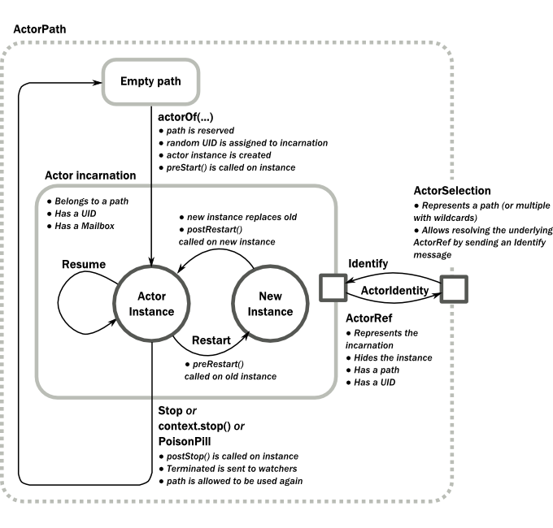

# Actors

The [Actor Model](http://en.wikipedia.org/wiki/Actor_model) provides a higher level of abstraction for writing concurrent and distributed systems. It alleviates the developer from having to deal with explicit locking and thread management, making it easier to write correct concurrent and parallel systems. Actors were defined in the 1973 paper by Carl Hewitt but have been popularized by the Erlang language, and used for example at Ericsson with great success to build highly concurrent and reliable telecom systems.

[Actor模型](http://en.wikipedia.org/wiki/Actor_model)提供了一个编写并发和分布式系统更高的水平的抽象。它减轻了开发人员必须处理显式锁定和线程管理的难度，使编写正确的并发和并行系统变得更加容易。卡尔·休伊特在1973年的论文中对Actor进行了定义，并通过Erlang进行了推广，例如，在爱立信使用其建立高度并行和可靠的电信系统并取得了巨大成功。

The API of Akka’s Actors is similar to Scala Actors which has borrowed some of its syntax from Erlang.

Akka Actor的API类似于Scala Actor，并借鉴了Erlang中的一些语法。

## 创建Actor

@@@ note

Since Akka enforces parental supervision every actor is supervised and (potentially) the supervisor of its children, it is advisable that you familiarize yourself with @ref:[Actor Systems](general/actor-systems.md) and @ref:[supervision](general/supervision.md) and it may also help to read @ref:[Actor References, Paths and Addresses](general/addressing.md).

由于Akka强制实施父级监督，因此每个Actor都受到监督并且（可能）是其子级的监督人，因此建议你熟悉[Actor系统](https://doc.akka.io/docs/akka/current/general/actor-systems.html)、[监督](https://doc.akka.io/docs/akka/current/general/supervision.html)还可以阅读[Actor引用，路径和地址](https://doc.akka.io/docs/akka/current/general/addressing.html)来获取帮助。

@@@

### 定义一个Actor类

@@@ div { .group-scala }

Actors are implemented by extending the `Actor` base trait and implementing the `receive` method. The `receive` method should define a series of case statements (which has the type `PartialFunction[Any, Unit]`) that defines which messages your Actor can handle, using standard Scala pattern matching, along with the implementation of how the messages should be processed.

Actor扩展了`Actor`基本特质和实现了`receive`方法。`receive`方法定义了一系列case语句（具有`PartialFunction[Any, Unit]`类型），使用标准的Scala模式匹配和能够解释消息是怎么处理的函数来定义你的Actor可以处理哪些消息。

@@@

@@@ div { .group-java }

Actor classes are implemented by extending the `AbstractActor` class and setting the “initial behavior” in `createReceive` method.

Actor类是通过继承 `AbstractActor`类并在`createReceive` 中设置初始化行为来实现的

`createReceive` method has no arguments and returns `AbstractActor.Receive`. It defines which messages your Actor can handle, along with the implementation of how the messages should be processed. You can build such behavior with a builder named  `ReceiveBuilder`. This build has convenient factory in `AbstractActor` called  `receiveBuilder`.

`createReceive` 方法没有参数，并且返回 `AbstractActor.Receive`，它定义了你的Actor能处理什么消息，以及他们是怎么处理该消息的。你可以通过名为`ReceiveBuilder`的构造器构造该行为，这个构造在 `AbstractActor` 中有个简易工厂叫  `receiveBuilder`。

@@@

Here is an example:

这里是一个例子：

Scala
:  @@snip [ActorDocSpec.scala]($code$/scala/docs/actor/ActorDocSpec.scala) { #imports1 #my-actor }

Java
:  @@snip [MyActor.java]($code$/java/jdocs/actor/MyActor.java) { #imports #my-actor }

Please note that the Akka Actor @scala[`receive`] message loop is exhaustive, which is different compared to Erlang and the late Scala Actors. This means that you need to provide a pattern match for all messages that it can accept and if you want to be able to handle unknown messages then you need to have a default case as in the example above. Otherwise an `akka.actor.UnhandledMessage(message, sender, recipient)` will be published to the `ActorSystem`'s `EventStream`.

请注意，Akka Actor `receive`消息循环是详细的，与Erlang和后期的Scala Actor不同。这意味着你需要为它提供可以接受的所有消息模式匹配，并且如果你希望能够处理未知消息，则需要像上例中那样使用默认匹配。否则，`akka.actor.UnhandledMessage(message, sender, recipient)`将被发布到`ActorSystem`的`EventStream`上。

Note further that the return type of the behavior defined above is `Unit`; if the actor shall reply to the received message then this must be done explicitly as explained below.

进一步需要注意的是，上面定义的行为的返回类型是`Unit`; 如果Actor应回复收到的消息，则必须按照下面的说明明确进行。

The result of the @scala[`receive` method is a partial function object, which is] @java[`createReceive` method is `AbstractActor.Receive` which is a wrapper around partial scala function object. It is] stored within the actor as its “initial behavior”,  see [Become/Unbecome](#become-unbecome) for further information on changing the behavior of an actor after its construction.

`receive`方法的结果是一个偏函数对象，该对象作为“初始行为”存储在Actor中，请参阅[变成/不变成](https://doc.akka.io/docs/akka/current/actors.html#become-unbecome)以获取有关在其构建后更改Actor的行为的更多信息。

@@@ div { .group-scala }

#### 以下是你可以在浏览器中编辑并运行的另一个示例：

@@fiddle [ActorDocSpec.scala]($code$/scala/docs/actor/ActorDocSpec.scala) { #fiddle_code height=400px extraParams=theme=light&layout=v75&passive cssStyle=width:100%; }

@@@

### Props

`Props` is a configuration class to specify options for the creation of actors, think of it as an immutable and thus freely shareable recipe for creating an actor including associated deployment information (e.g. which dispatcher to use, see more below). Here are some examples of how to create a `Props` instance.

`Props`是一个配置类，用于指定创建Actor的选项，可将其视为创建包含了相关部署信息（例如，要使用哪个调度程序，请参阅下面更多信息）的Actor的不变且可自由共享的配方。以下是一些如何创建`Props`实例的示例。

Scala
:  @@snip [ActorDocSpec.scala]($code$/scala/docs/actor/ActorDocSpec.scala) { #creating-props }

Java
:  @@snip [ActorDocTest.java]($code$/java/jdocs/actor/ActorDocTest.java) { #import-props #creating-props }

The second variant shows how to pass constructor arguments to the `Actor` being created, but it should only be used outside of actors as explained below.

第二个变体显示了如何将构造函数参数传递给正在创建的`Actor`实例，但它只能在Actor之外使用，如下所述

The last line shows a possibility to pass constructor arguments regardless of the context it is being used in. The presence of a matching constructor is verified during construction of the `Props` object, resulting in an `IllegalArgumentException` if no or multiple matching constructors are found.

最后一行显示了不需了解上下文的情况下传递构造函数参数的可能性。在构造`Props`对象期间需要验证匹配的构造函数的存在，如果发现没有或有多个匹配的构造函数，将导致`IllegalArgumentException`。

@@@ note { .group-scala }

The recommended approach to create the actor `Props` is not supported for cases when the actor constructor takes value classes as arguments.

不支持使用value类作为Actor构造参数的。

@@@

#### Dangerous Variants
Scala
:  @@snip [ActorDocSpec.scala]($code$/scala/docs/actor/ActorDocSpec.scala) { #creating-props-deprecated }

Java
:  @@snip [ActorDocTest.java]($code$/java/jdocs/actor/ActorDocTest.java) { #creating-props-deprecated }

This method is not recommended to be used within another actor because it encourages to close over the enclosing scope, resulting in non-serializable `Props` and possibly race conditions (breaking the actor encapsulation).On the other hand using this variant in a `Props` factory in the actor’s companion object as documented under “Recommended Practices” below is completely fine.

不建议在另一个Actor中使用此方法，因为它鼓励在封闭范围内结束，它将导致不可序列化的`Props`和可能会引起竞争条件（破坏Actor封装）。另一方面，在Actor伴随对象中的`Props`工厂中按照下面“推荐做法”中记录的方式使用此变体就很好了。

There were two use-cases for these methods: passing constructor arguments to the actor—which is solved by the newly introduced @scala[`Props.apply(clazz, args)`] @java[`Props.create(clazz, args)`] method above or the recommended practice below—and creating actors “on the spot” as anonymous classes. The latter should be solved by making these actors named classes instead (if they are not declared within a top-level `object` then the enclosing instance’s `this` reference needs to be passed as the first argument).

这些方法有两种使用情况：将构造函数参数传递给Actor（通过上面新引入的`Props.apply(clazz, args)`方法或下面推荐的方式来实现），以及“当场”以匿名类的方式创建Actor。后者应该通过将这些Actor命名为class来解决（如果它们没有在顶层的`object`中声明，那么封装实例的`this`引用需要作为第一个参数传入）。

@@@ warning

Declaring one actor within another is very dangerous and breaks actor encapsulation. Never pass an actor’s `this` reference into `Props`!

在另一个Actor中声明一个Actor是非常危险的，这会破坏Actor的封装。切勿将Actor的`this`引用传递给`Props`！

@@@

@@@ div { .group-scala }

#### 边缘情况

There are two edge cases in actor creation with `Props`:

在利用`Props`创建Actor时有两个边缘案例：

 * An actor with `AnyVal` arguments.
 * `AnyVal`类型参数的Actor。

@@snip [PropsEdgeCaseSpec.scala]($code$/scala/docs/actor/PropsEdgeCaseSpec.scala) { #props-edge-cases-value-class }

@@snip [PropsEdgeCaseSpec.scala]($code$/scala/docs/actor/PropsEdgeCaseSpec.scala) { #props-edge-cases-value-class-example }

 * An actor with default constructor values.
 * 具有默认构造器值的Actor

@@snip [PropsEdgeCaseSpec.scala]($code$/scala/docs/actor/PropsEdgeCaseSpec.scala) { #props-edge-cases-default-values }

In both cases an `IllegalArgumentException` will be thrown stating no matching constructor could be found.

在这两种情况下都会抛出`IllegalArgumentException`，说找不到匹配的构造函数。

The next section explains the recommended ways to create `Actor` props in a way, which simultaneously safe-guards against these edge cases.

下一节将介绍推荐的创建`Actor` props的方法，同时这些方法可以安全地避免这些边缘情况。

@@@

#### 推荐做法

It is a good idea to provide @scala[factory methods on the companion object of each `Actor`] @java[static factory methods for each `Actor`] which help keeping the creation of suitable `Props` as close to the actor definition as possible. This also avoids the pitfalls associated with using the @scala[`Props.apply(...)` method which takes a by-name argument, since within a companion object] @java[ `Props.create(...)` method which takes arguments as constructor parameters, since within static method] the given code block will not retain a reference to its enclosing scope:

在每个`Actor` 的伴随对象上提供工厂方法是一个不错的主意，这有助于尽可能接近Actor的定义来创建合适的`Props`。这也避免了与使用`Props.apply(...)`带名称参数的方法的相关缺陷，因为在伴随对象中，给定代码块不会保留对其封闭范围的引用：

Scala
:  @@snip [ActorDocSpec.scala]($code$/scala/docs/actor/ActorDocSpec.scala) { #props-factory }

Java
:  @@snip [ActorDocTest.java]($code$/java/jdocs/actor/ActorDocTest.java) { #props-factory }

Another good practice is to declare what messages an Actor can receive @scala[in the companion object of the Actor] @java[as close to the actor definition as possible (e.g. as static classes inside the Actor or using other suitable class)],which makes easier to know what it can receive:

另一个很好的做法是在 Actor 的伴随对象中声明Actor可以接收什么消息，从而更容易知道它可以接收的内容：

Scala
:  @@snip [ActorDocSpec.scala]($code$/scala/docs/actor/ActorDocSpec.scala) { #messages-in-companion }

Java
:  @@snip [ActorDocTest.java]($code$/java/jdocs/actor/ActorDocTest.java) { #messages-in-companion }

### 用Props创建Actor

Actors are created by passing a `Props` instance into the `actorOf` factory method which is available on `ActorSystem` and `ActorContext`.

通过将`Props`实例传递给`actorOf`工厂方法，可用于在`ActorSystem`和 `ActorContext`中创建Actor。

Scala
:  @@snip [ActorDocSpec.scala]($code$/scala/docs/actor/ActorDocSpec.scala) { #system-actorOf }

Java
:  @@snip [ActorDocTest.java]($code$/java/jdocs/actor/ActorDocTest.java) { #import-actorRef }

Using the `ActorSystem` will create top-level actors, supervised by the actor system’s provided guardian actor, while using an actor’s context will create a child actor.

使用`ActorSystem`将创建由Actor系统提供监督的顶级Actor，而使用`ActorContext`则会创建一个子级Actor。

Scala
:  @@snip [ActorDocSpec.scala]($code$/scala/docs/actor/ActorDocSpec.scala) { #context-actorOf }

Java
:  @@snip [ActorDocTest.java]($code$/java/jdocs/actor/ActorDocTest.java) { #context-actorOf }

It is recommended to create a hierarchy of children, grand-children and so on such that it fits the logical failure-handling structure of the application,see @ref:[Actor Systems](general/actor-systems.md).

建议创建一个子级，孙子级这样的层次结构，使其适合应用程序的逻辑故障处理结构，请参阅[Actor系统](https://doc.akka.io/docs/akka/current/general/actor-systems.html)。

The call to `actorOf` returns an instance of `ActorRef`. This is a handle to the actor instance and the only way to interact with it. The `ActorRef` is immutable and has a one to one relationship with the Actor it represents. The `ActorRef` is also serializable and network-aware.This means that you can serialize it, send it over the wire and use it on a remote host and it will still be representing the same Actor on the original node, across the network.

调用`actorOf`返回一个`ActorRef`实例。这是对actor实例的处理并与之交互的唯一方法。这`ActorRef`是不变的，并且与它所代表的Actor有一对一的关系。`ActorRef`同时也是可序列化和网络感知的。这意味着你可以将其序列化，通过网络发送并在远程主机上使用它，并且它仍然会在网络上代表原始节点上的相同Actor。

The name parameter is optional, but you should preferably name your actors,since that is used in log messages and for identifying actors. The name must not be empty or start with `$`, but it may contain URL encoded characters (eg. `%20` for a blank space).  If the given name is already in use by another child to the same parent an `InvalidActorNameException` is thrown.

name参数是可选的，但你最好为你的Actor命名，因为它在日志消息中用于标识Actor。该名称不能为空或`$`开头，但可以包含使用URL编码的字符（例如：`%20`对应空格）。如果给定的名称已被用于同一个父级下的其他子级，则会引发`InvalidActorNameException`异常。

Actors are automatically started asynchronously when created.

Actor在创建时异步启动

@@@ div { .group-scala }

#### Value类作为构造函数参数

The recommended way to instantiate actor props uses reflection at runtime to determine the correct actor constructor to be invoked and due to technical limitations is not supported when said constructor takes arguments that are value classes.In these cases you should either unpack the arguments or create the props by calling the constructor manually:

实例化Actor Prop的推荐方法是在运行时使用反射来确定要调用的正确Actor构造函数，但由于技术所限，所述构造函数不能接受value类的参数。在这些情况下，你应该解开参数或者通过手动调用构造函数来创建Prop：

@@snip [ActorDocSpec.scala]($code$/scala/docs/actor/ActorDocSpec.scala) { #actor-with-value-class-argument }

@@@

### 依赖注入

If your `Actor` has a constructor that takes parameters then those need to be part of the `Props` as well, as described [above](Props_). But there are cases when a factory method must be used, for example when the actual constructor arguments are determined by a dependency injection framework.

如果你的`Actor`有一个带参构造函数，那么这些参数也最好是`Props`的一部分，如[以上所述](https://doc.akka.io/docs/akka/current/Props_)的那样。但有些情况下，必须使用工厂方法，例如实际构造函数参数由依赖注入框架确定时。

Scala
:  @@snip [ActorDocSpec.scala]($code$/scala/docs/actor/ActorDocSpec.scala) { #creating-indirectly }

Java
:  @@snip [DependencyInjectionDocTest.java]($code$/java/jdocs/actor/DependencyInjectionDocTest.java) { #import #creating-indirectly }

@@@ warning

You might be tempted at times to offer an `IndirectActorProducer` which always returns the same instance, e.g. by using a @scala[`lazy val`.] @java[static field.] This is not supported, as it goes against the meaning of an actor restart, which is described here: @ref:[What Restarting Means](general/supervision.md#supervision-restart).

有时你可能会试图提供一个始终返回相同实例的`IndirectActorProducer`，例如通过使用 `lazy val`。 这是不被支持的，因为它违背了Actor重新启动的含义，参见：[重新启动的意义](https://doc.akka.io/docs/akka/current/general/supervision.html#supervision-restart)。

When using a dependency injection framework, actor beans *MUST NOT* have singleton scope.

当使用依赖注入框架时，actor bean ***一定不能***有单例作用域。

@@@

Techniques for dependency injection and integration with dependency injection frameworks are described in more depth in the [Using Akka with Dependency Injection](http://letitcrash.com/post/55958814293/akka-dependency-injection) guideline and the [Akka Java Spring](https://github.com/typesafehub/activator-akka-java-spring) tutorial.

依赖注入技术和与依赖注入框架的集成在[Using Akka with Dependency Injection](http://letitcrash.com/post/55958814293/akka-dependency-injection)指南和[Akka Java Spring](https://github.com/typesafehub/activator-akka-java-spring)教程中有更深入的描述。

### 收件箱

When writing code outside of actors which shall communicate with actors, the `ask` pattern can be a solution (see below), but there are two things it cannot do: receiving multiple replies (e.g. by subscribing an `ActorRef` to a notification service) and watching other actors’ lifecycle. For these purposes there is the `Inbox` class:

当在与其他Actor通讯的Actor之外编写代码时，`ask`模式算是一个解决方案（见下文），但有两件事是它不能做的：接收多个回复（例如：通过向通知服务订阅`ActorRef`）和监视其他Actor的生命周期。为了这些目的，于是有了这样的`Inbox`类：

Scala
:  @@snip [ActorDSLSpec.scala]($akka$/akka-actor-tests/src/test/scala/akka/actor/ActorDSLSpec.scala) { #inbox }

Java
:  @@snip [InboxDocTest.java]($code$/java/jdocs/actor/InboxDocTest.java) { #inbox }


@@@ div { .group-scala }

There is an implicit conversion from inbox to actor reference which means that in this example the sender reference will be that of the actor hidden away within the inbox. This allows the reply to be received on the last line.Watching an actor is quite simple as well:

在收件箱到Actor引用之间存在一个隐式转换，这意味着在这个例子中，发件人引用将是隐藏在收件箱中的Actor的引用。这使得在上述代码的最后一行中能够接收到回复。监视Actor也很简单：

@@snip [ActorDSLSpec.scala]($akka$/akka-actor-tests/src/test/scala/akka/actor/ActorDSLSpec.scala) { #watch }

@@@

@@@ div { .group-java }

The `send` method wraps a normal `tell` and supplies the internal actor’s reference as the sender. This allows the reply to be received on the last line.  Watching an actor is quite simple as well:

`send`方法包装了常用的`tell`方法，并且提供内部的Actor引用作为发件人，这使得能够在最后一行接收到回复，监视Actor也很简单：

@@snip [InboxDocTest.java]($code$/java/jdocs/actor/InboxDocTest.java) { #watch }

@@@

## Actor API

@scala[The `Actor` trait defines only one abstract method, the above mentioned `receive`, which implements the behavior of the actor.] @java[The `AbstractActor` class defines a method called `createReceive`,that is used to set the “initial behavior” of the actor.]

Actor特质只定义了一个抽象方法，就是上面提到的`receive`，其实现了Actor的行为。

If the current actor behavior does not match a received message,`unhandled` is called, which by default publishes an `akka.actor.UnhandledMessage(message, sender, recipient)` on the actor system’s event stream (set configuration item `akka.actor.debug.unhandled` to `on` to have them converted into actual Debug messages).

如果当前的Actor行为与接收到的消息不匹配，那么默认情况下会调用`unhandled` ，它会在Actor系统的事件流上发布一个`akka.actor.UnhandledMessage(message, sender, recipient)`事件（将配置项中的`akka.actor.debug.unhandled`设置为`on`将它们转换为实际的Debug消息）。

In addition, it offers:

此外，它还提供：

 * @scala[`self`] @java[`getSelf()`] reference to the `ActorRef` of the actor
 * `self` 作为Actor的`ActorRef`的引用
 * @scala[`sender`] @java[`getSender()`] reference sender Actor of the last received message, typically used as described in @scala[[Actor.Reply](#actor-reply)] @java[[LambdaActor.Reply](#lambdaactor-reply)]
 * `sender` 作为最后收到的消息的发送者的引用，典型按照[Actor.Reply](https://doc.akka.io/docs/akka/current/actors.html#actor-reply)中所述那样使用
 * @scala[`supervisorStrategy`] @java[`supervisorStrategy()`] user overridable definition the strategy to use for supervising child actors
 * `supervisorStrategy` 作为监督子级Actor的、可被用户重定义的策略
   This strategy is typically declared inside the actor in order to have access to the actor’s internal state within the decider function: since failure is communicated as a message sent to the supervisor and processed like other messages (albeit outside of the normal behavior), all values and variables within the actor are available, as is the `sender` reference (which will be the immediate child reporting the failure; if the original failure occurred within a distant descendant it is still reported one level up at a time).

   这个策略通常在Actor中声明，以便在决策函数中访问Actor的内部状态：因为失败是作为消息发送给监督者，就像其他消息那样被处理（尽管不同于正常行为）,Actor中所有值和变量是可用的，就像`sender`引用（报告错误的直接子级;如果原始失败发生在远处的子级，那么它仍然一次向上报告一个等级）。
 * @scala[`context`] @java[`getContext()`] exposes contextual information for the actor and the current message, such as:
 * `context` 暴露出Actor和当前消息的上下文信息，例如：
    * factory methods to create child actors (`actorOf`)
    * 创建子Actor的工厂方法（`actorOf`）
    * system that the actor belongs to
    * 该Actor所属的系统
    * parent supervisor
    * 父级监督者
    * supervised children
    * 监督的子级
    * lifecycle monitoring
    * 生命周期监控
    * hotswap behavior stack as described in @scala[[Actor.HotSwap](#actor-hotswap)] @java[[Become/Unbecome](#actor-hotswap)]
    * 在[Actor.HotSwap](https://doc.akka.io/docs/akka/current/actors.html#actor-hotswap)中描述的热插拔行为堆栈

@@@ div { .group-scala }

You can import the members in the `context` to avoid prefixing access with `context.`

你可以导入`context`成员以避免使用`context.`前缀访问

@@snip [ActorDocSpec.scala]($code$/scala/docs/actor/ActorDocSpec.scala) { #import-context }

@@@

The remaining visible methods are user-overridable life-cycle hooks which are described in the following:

剩下的可见方法是用户可重写的生命周期调用，如下所述：

Scala
:  @@snip [Actor.scala]($akka$/akka-actor/src/main/scala/akka/actor/Actor.scala) { #lifecycle-hooks }

Java
:  @@snip [ActorDocTest.java]($code$/java/jdocs/actor/ActorDocTest.java) { #lifecycle-callbacks }  

The implementations shown above are the defaults provided by the @scala[`Actor` trait.] @java[`AbstractActor` class.]

上面是`Actor`特质默认提供的实现。

<a id="actor-lifecycle"></a>
### Actor Lifecycle



A path in an actor system represents a "place" which might be occupied by a living actor. Initially (apart from system initialized actors) a path is empty. When `actorOf()` is called it assigns an *incarnation* of the actor described by the passed `Props` to the given path. An actor incarnation is identified by the path *and a UID*. 

Actor系统中的路径表示可能由活着的Actor占据的“地点”。一开始（除了由系统初始化的Actor）路径是空的。当`actorOf()`方法被调用，它将通过传递的`Props`对给定的路径分配Actor的化身。Actor化身将由*路径*和*UID*来标识。

It is worth noting about the difference between:

值得注意的是下面两点的区别：

* restart 
* 重启
* stop, followed by re-creation of actor as explained below.
* 停止，然后如下所述重新创建Actor

A restart only swaps the `Actor` instance defined by the `Props` but the incarnation and hence the UID remains the same.As long as the incarnation is same, you can keep using the same `ActorRef`.Restart is handled by the @ref:[Supervision Strategy](fault-tolerance.md#creating-a-supervisor-strategy) of actor's parent actor,and there is more discussion about @ref:[what restart means](general/supervision.md#supervision-restart).

重启只会改变由`Props`定义的`Actor`实例而不是化身，因此UID保持不变。只要化身是相同的，你可以继续使用相同的`ActorRef`。重新启动由Actor的父级[监督策略](https://doc.akka.io/docs/akka/current/fault-tolerance.html#creating-a-supervisor-strategy)处理，在[重新启动的意义](https://doc.akka.io/docs/akka/current/general/supervision.html#supervision-restart)中有更多的讨论。

The lifecycle of an incarnation ends when the actor is stopped. At that point the appropriate lifecycle events are called and watching actors are notified of the termination. After the incarnation is stopped, the path can be reused again by creating an actor with `actorOf()`. In this case the name of the new incarnation will be the same as the previous one but the UIDs will differ. An actor can be stopped by the actor itself, another actor or the `ActorSystem` (see [Stopping actors](#stopping-actors)).

当Actor停止时，化身的生命周期结束。此时将调用适当的生命周期事件，并通知相关的监视Actor。化身停止后，可以通过`actorOf()`方法创建Actor来再次重用该路径。在这种情况下，新化身的名称将与前一个化身相同，但UID将有所不同。一个Actor可以被Actor本身或另一个Actor或`ActorSystem`（参见[停止Actor](https://doc.akka.io/docs/akka/current/actors.html#stopping-actors)）停止。

@@@ note

It is important to note that Actors do not stop automatically when no longer referenced, every Actor that is created must also explicitly be destroyed. The only simplification is that stopping a parent Actor will also recursively stop all the child Actors that this parent has created.

值得注意的是，当Actor不再被引用时，它不会自动停止，每个创建的Actor必须被明确地销毁。唯一的简化是停止一个父级Actor也会递归停止这个父节点创建的所有子级Actor。

@@@

An `ActorRef` always represents an incarnation (path and UID) not just a given path. Therefore if an actor is stopped and a new one with the same name is created an `ActorRef` of the old incarnation will not point to the new one.

一个`ActorRef`总是代表一个化身（路径和UID），而不只是一个给定的路径。因此，如果一个Actor停止并且创建一个具有相同名字的新Actor，那么旧Actor的`ActorRef`将不会指向新Actor。

`ActorSelection` on the other hand points to the path (or multiple paths if wildcards are used) and is completely oblivious to which incarnation is currently occupying it. `ActorSelection` cannot be watched for this reason. It is possible to resolve the current incarnation's `ActorRef` living under the path by sending an `Identify` message to the `ActorSelection` which will be replied to with an `ActorIdentity` containing the correct reference (see [ActorSelection](#actorselection)). This can also be done with the `resolveOne `  method of the `ActorSelection`, which returns a `Future` of the matching `ActorRef`.

另一方面`ActorSelection`指向了路径（如果使用通配符，则指向多个路径），而且完全不知道当前哪个化身占据了该路径。`ActorSelection`也因为这个原因无法被监视。可以通过向`ActorSelection`发送一条`Identify`消息，它将回复包含正确引用的`ActorIdentity`，并以此来确定路径下的当前`ActorRef`的化身（见[ActorSelection](https://doc.akka.io/docs/akka/current/actors.html#actorselection)）。这也可以通过`ActorSelection`的`resolveOne`方法完成，它将返回一个匹配的`ActorRef`的`Future`对象。

<a id="deathwatch"></a>
### Lifecycle Monitoring 即 DeathWatch

In order to be notified when another actor terminates (i.e. stops permanently,not temporary failure and restart), an actor may register itself for reception of the `Terminated` message dispatched by the other actor upon termination (see [Stopping Actors](#stopping-actors)). This service is provided by the `DeathWatch` component of the actor system.

为了在另一个Actor终止时（永久停止，而不是暂时失败或重新启动）得到通知，Actor可以注册自己以便接收由另一个Actor基于终止而分发的`Terminated`消息（参见[停止Actor](https://doc.akka.io/docs/akka/current/actors.html#stopping-actors)）。该服务由Actor系统的`DeathWatch`组件提供。

Registering a monitor is easy:

注册监控器很简单：

Scala
:  @@snip [ActorDocSpec.scala]($code$/scala/docs/actor/ActorDocSpec.scala) { #watch }

Java
:  @@snip [ActorDocTest.java]($code$/java/jdocs/actor/ActorDocTest.java) { #import-terminated #watch }

It should be noted that the `Terminated` message is generated independent of the order in which registration and termination occur. In particular, the watching actor will receive a `Terminated` message even if the watched actor has already been terminated at the time of registration.

应该注意的是，`Terminated`消息是独立于注册行为和终止行为发生的顺序生成的。特别是，即使被监视Actor在注册时就已经被终止，监视Actor也将收到`Terminated`消息。

Registering multiple times does not necessarily lead to multiple messages being generated, but there is no guarantee that only exactly one such message is received: if termination of the watched actor has generated and queued the message, and another registration is done before this message has been processed, then a second message will be queued, because registering for monitoring of an already terminated actor leads to the immediate generation of the `Terminated` message.

多次注册并不一定会导致生成多条消息，但不能保证只收到一条这样的消息：如果被监视的Actor已经终止并消息已经入队，并且在该消息处理之前发生了另一个注册，这时第二条消息将入队，因为对已经终止的Actor的监视注册将导致立刻生成`Terminated`消息。

It is also possible to deregister from watching another actor’s liveliness using `context.unwatch(target)`. This works even if the `Terminated` message has already been enqueued in the mailbox; after calling `unwatch` no `Terminated` message for that actor will be processed anymore.

也可以通过 `context.unwatch(target)`方法撤销对其他Actor生命周期的监视。即使`Terminated`邮件已经在邮箱中排队了，当调用`unwatch`之后监视者将不再处理任何来自该Actor的`Terminated`消息。

<a id="start-hook"></a>
### Start调用

Right after starting the actor, its `preStart` method is invoked.

在启动Actor之后，将调用它的`preStart`方法。

Scala
:  @@snip [ActorDocSpec.scala]($code$/scala/docs/actor/ActorDocSpec.scala) { #preStart }

Java
:  @@snip [ActorDocTest.java]($code$/java/jdocs/actor/ActorDocTest.java) { #preStart }

This method is called when the actor is first created. During restarts it is called by the default implementation of `postRestart`, which means that by overriding that method you can choose whether the initialization code in this method is called only exactly once for this actor or for every restart. Initialization code which is part of the actor’s constructor will always be called when an instance of the actor class is created, which happens at every restart.

这个方法在第一次创建Actor时被调用。在重启期间，它被`postRestart`默认调用，这意味着通过覆盖该方法，你可以选择此方法中的初始化代码是否仅针对该Actor调用一次或每次重新启动都调用。Actor构造函数中的初始化代码，每当创建Actor实例时都会被调用，这种情况伴随着每次的重启。

<a id="restart-hook"></a>
### Restart调用

All actors are supervised, i.e. linked to another actor with a fault handling strategy. Actors may be restarted in case an exception is thrown while processing a message (see @ref:[supervision](general/supervision.md)). This restart involves the hooks mentioned above:

所有Actor都受到监督，也就是通过故障处理策略与其他Actor相关联。如果在处理消息时抛出异常（参见[监督](https://doc.akka.io/docs/akka/current/general/supervision.html)），则可能会重新启动Actor 。这个重启过程涉及到上面提到的调用：

1. The old actor is informed by calling `preRestart` with the exception which caused the restart and the message which triggered that exception; the latter may be `None` if the restart was not caused by processing a message, e.g. when a supervisor does not trap the exception and is restarted in turn by its supervisor, or if an actor is restarted due to a sibling’s failure. If the message is available, then that message’s sender is also accessible in the usual way (i.e. by calling `sender`). This method is the best place for cleaning up, preparing hand-over to the fresh actor instance, etc.  By default it stops all children and calls `postStop`.
2. 旧的Actor将被通过调用`preRestart`方法的告知，该调用捎带着造成重启的异常以及触发该异常的消息; 如果重启不是由处理消息引起的，那么触发异常的消息可能是`None`，例如，当监督者没有捕获异常并轮流重启子级时，或者由于同级失败而导致重启Actor时。如果消息有效，那么该消息的发送者也可以以常规方式（即通过调用`sender`）访问。这个方法是清理内容，与新Actor实例做交接等动作的最佳场所。默认情况下，它会停止所有的子级并调用`postStop`。
3. The initial factory from the `actorOf` call is used to produce the fresh instance.
4. 来自`actorOf`调用的初始化工厂用于生成新的实例。
5. The new actor’s `postRestart` method is invoked with the exception which caused the restart. By default the `preStart` is called, just as in the normal start-up case.
6. 新Actor的`postRestart`方法被调用，导致重新启动的异常。在默认情况下`preStart`被调用，就像正常启动情况下那样。

An actor restart replaces only the actual actor object; the contents of the mailbox is unaffected by the restart, so processing of messages will resume after the `postRestart` hook returns. The message that triggered the exception will not be received again. Any message sent to an actor while it is being restarted will be queued to its mailbox as usual.

Actor的重启只替换了实际的Actor对象; 邮箱的内容不受重新启动影响，因此将会在`postRestart`调用返回后恢复消息处理。触发异常的消息将不会再次被接收。在重新启动时发送给该Actor的任何消息将照常进入其邮箱队列。

@@@ warning

Be aware that the ordering of failure notifications relative to user messages is not deterministic. In particular, a parent might restart its child before it has processed the last messages sent by the child before the failure. See @ref:[Discussion: Message Ordering](general/message-delivery-reliability.md#message-ordering) for details.

请注意，用户消息和故障通知的顺序是不确定的。特别是，父级可能在处理来自于子级的最后一条(发生错误前)消息之前重新启动子级Actor。有关详细信息，请参阅[讨论：消息顺序](https://doc.akka.io/docs/akka/current/general/message-delivery-reliability.html#message-ordering)。

@@@

<a id="stop-hook"></a>
### Stop调用

After stopping an actor, its `postStop` hook is called, which may be used e.g. for deregistering this actor from other services. This hook is guaranteed to run after message queuing has been disabled for this actor, i.e. messages sent to a stopped actor will be redirected to the `deadLetters` of the `ActorSystem`.

在Actor停止之后，`postStop`方法被调用，它可以用于从其他服务中注销此Actor等用途。这个调用是能够保证运行在该Actor的消息队列被禁用后的，也就是说发送到停止的Actor的邮件都将被重定向到`ActorSystem`的`deadLetters`中。

<a id="actorselection"></a>
## 通过Actor选择识别Actor

As described in @ref:[Actor References, Paths and Addresses](general/addressing.md), each actor has a unique logical path, which is obtained by following the chain of actors from child to parent until reaching the root of the actor system, and it has a physical path, which may differ if the supervision chain includes any remote supervisors. These paths are used by the system to look up actors, e.g. when a remote message is received and the recipient is searched, but they are also useful more directly: actors may look up other actors by specifying absolute or relative paths—logical or physical—and receive back an `ActorSelection` with the result:

如[Actor参考，路径和地址](https://doc.akka.io/docs/akka/current/general/addressing.html)中所述，每个Actor都有一条唯一的逻辑路径，该路径是从子级到父级一直到根的路径链，并且它有一个物理路径，如果监管链中存在任何远程监督者，那么它会与逻辑路径不同。系统使用这些路径来查找Actor，例如，收到远程消息并且搜索接收者时，但它们有更直接的用处：Actor可以通过指定绝对或相对路径（逻辑或物理路径）来查找其他Actor，并收到一个`ActorSelection`作为结果：

- ​

Scala
:  @@snip [ActorDocSpec.scala]($code$/scala/docs/actor/ActorDocSpec.scala) { #selection-local }

Java
:  @@snip [ActorDocTest.java]($code$/java/jdocs/actor/ActorDocTest.java) { #selection-local }

@@@ note

It is always preferable to communicate with other Actors using their ActorRef instead of relying upon ActorSelection. Exceptions are

最好使用ActorRef而不是依赖ActorSelection与其他Actor进行通信。除非是

 * sending messages using the @ref:[At-Least-Once Delivery](persistence.md#at-least-once-delivery) facility
 * 使用[At-Least-Once Delivery](https://doc.akka.io/docs/akka/current/persistence.html#at-least-once-delivery)工具发送消息
 * initiating first contact with a remote system
 * 与远程系统的首次联系

In all other cases ActorRefs can be provided during Actor creation or initialization, passing them from parent to child or introducing Actors by sending their ActorRefs to other Actors within messages.

在所有其他情况下，ActorRef可以在Actor创建或初始化期间提供，或者由父级传给子级，或者包含在消息中发送给其他Actor。

@@@

The supplied path is parsed as a `java.net.URI`, which basically means that it is split on `/` into path elements. If the path starts with `/`, it is absolute and the look-up starts at the root guardian (which is the parent of `"/user"`); otherwise it starts at the current actor. If a path element equals `..`, the look-up will take a step “up” towards the supervisor of the currently traversed actor, otherwise it will step “down” to the named child. It should be noted that the `..` in actor paths here always means the logical structure, i.e. the supervisor.

提供的路径被解析为 `java.net.URI`，这意味着它被`/`分割成路径元素。如果路径从`/`开始，它是绝对路径，并且查找开始于根监督者（`"/user"`的父节点）; 否则它从当前Actor开始。如果一个路径元素是`..`，则查找将“向上”到其监督者，否则它将“向下”到指定的子级。应该指出，Actor路径中的`..`在这里总是意味着逻辑结构，即监督者。

The path elements of an actor selection may contain wildcard patterns allowing for broadcasting of messages to that section:

Actor选择的路径元素可能包含通配符模式，从而允许将消息广播到该部分：

Scala
:  @@snip [ActorDocSpec.scala]($code$/scala/docs/actor/ActorDocSpec.scala) { #selection-wildcard }

Java
:  @@snip [ActorDocTest.java]($code$/java/jdocs/actor/ActorDocTest.java) { #selection-wildcard }

Messages can be sent via the `ActorSelection` and the path of the `ActorSelection` is looked up when delivering each message. If the selection does not match any actors the message will be dropped.

消息可以通过`ActorSelection`发送，`ActorSelection`在传递消息时进行路径查找。如果该`ActorSelection`无法匹配任何Actor，则该消息将被丢弃。

To acquire an `ActorRef` for an `ActorSelection` you need to send a message to the selection and use the @scala[`sender()`] @java[`getSender()`] reference of the reply from the actor. There is a built-in `Identify` message that all Actors will understand and automatically reply to with a `ActorIdentity` message containing the `ActorRef`. This message is handled specially by the actors which are traversed in the sense that if a concrete name lookup fails (i.e. a non-wildcard path element does not correspond to a live actor) then a negative result is generated. Please note that this does not mean that delivery of that reply is guaranteed, it still is a normal message.

要获取一个`ActorSelection`的`ActorRef`，你需要向该选择发送一条消息并且利用其返回的`sender()`引用。有一个内置的 `Identify`消息，所有Actor都能理解它并且自动回复包含其`ActorRef`的`ActorIdentity`消息。这个消息由Actor特别处理，如果按具体名称查找失败（非通配符路径元素对应不上活动的Actor），会生成无效果的结果。请注意，这并不意味着该回复的传送是有保证的，它仍然是一条正常信息。

Scala
:  @@snip [ActorDocSpec.scala]($code$/scala/docs/actor/ActorDocSpec.scala) { #identify }

Java
:  @@snip [ActorDocTest.java]($code$/java/jdocs/actor/ActorDocTest.java) { #import-identify #identify }

You can also acquire an `ActorRef` for an `ActorSelection` with the `resolveOne` method of the `ActorSelection`. It returns a `Future` of the matching `ActorRef` if such an actor exists. @java[(see also @ref:[Java 8 Compatibility](java8-compat.md) for Java compatibility).] It is completed with failure `akka.actor.ActorNotFound` if no such actor exists or the identification didn't complete within the supplied `timeout`.

你也可以用 `ActorSelection`的`resolveOne`方法获得一个`ActorSelection`的`ActorRef`。如果存在匹配的Actor，它将返回一个对应`ActorRef`的`Future`对象。如果没有匹配的Actor存在或者没有在规定的`timeout`中完成识别，那么它将以`akka.actor.ActorNotFound`完成整个过程。

Remote actor addresses may also be looked up, if @ref:[remoting](remoting.md) is enabled:

如果[远程处理](https://doc.akka.io/docs/akka/current/remoting.html)已启用，那么也可以查找远程Actor的地址：

Scala
:  @@snip [ActorDocSpec.scala]($code$/scala/docs/actor/ActorDocSpec.scala) { #selection-remote }

Java
:  @@snip [ActorDocTest.java]($code$/java/jdocs/actor/ActorDocTest.java) { #selection-remote }

An example demonstrating actor look-up is given in @ref:[Remoting Sample](remoting.md#remote-sample).

[Remoting Sample](https://doc.akka.io/docs/akka/current/remoting.html#remote-sample)中给出了Actor查询的[示例](https://doc.akka.io/docs/akka/current/remoting.html#remote-sample)。

## 消息和不变性

@@@ warning { title=IMPORTANT }

Messages can be any kind of object but have to be immutable. @scala[Scala] @java[Akka] can’t enforce immutability (yet) so this has to be by convention. @scala[Primitives like String, Int, Boolean are always immutable. Apart from these the recommended approach is to use Scala case classes which are immutable (if you don’t explicitly expose the state) and works great with pattern matching at the receiver side.]

消息可以是任何类型的对象，但必须是不可变的。Scala（尚未）不能强制不变性，所以这得作为惯例。像String，Int，Boolean这样的原语总是不变的。除此之外，推荐的方法是使用不可变的Scala案例类（如果你没有明确的暴露状态），并且在接收方搭配模式匹配使用能取得很好的效果。

@@@

Here is an @scala[example:] @java[example of an immutable message:]

例子如下：

Scala
:  @@snip [ActorDocSpec.scala]($code$/scala/docs/actor/ActorDocSpec.scala) { #immutable-message-definition #immutable-message-instantiation }

Java
:  @@snip [ImmutableMessage.java]($code$/java/jdocs/actor/ImmutableMessage.java) { #immutable-message }

## 发送信息

Messages are sent to an Actor through one of the following methods.

消息通过以下方法之一发送给Actor。

 * @scala[`!`] @java[`tell` ] means “fire-and-forget”, e.g. send a message asynchronously and return immediately. @scala[Also known as `tell`.]
 * `!` 意味着“发完即忘”，例如异步发送消息并立即返回。也被称为`tell`。
 * @scala[`?`] @java[`ask`] sends a message asynchronously and returns a `Future` representing a possible reply. @scala[Also known as `ask`].
 * `?` 异步发送消息并返回`Future`对象，代表可能的答复。也被称为`ask`。

Message ordering is guaranteed on a per-sender basis.

邮件顺序是基于每个发件人的基础上保证的。

@@@ note

There are performance implications of using `ask` since something needs to keep track of when it times out, there needs to be something that bridges a `Promise` into an `ActorRef` and it also needs to be reachable through remoting. So always prefer `tell` for performance, and only `ask` if you must.

由于当超时时需要跟踪额外的信息，因此`ask`存在性能方面的影响，而且需要额外的处理将`Promise`与`ActorRef`关联，并且要使之可被远程访问。所以总是建议使用`tell`，而且只有在你必须的时候才使用`ask`。

@@@

@@@ div { .group-java }

In all these methods you have the option of passing along your own `ActorRef`. Make it a practice of doing so because it will allow the receiver actors to be able to respond to your message, since the sender reference is sent along with the message.

在所有这些方法中，你可以选择传递你自己的ActorRef。 使其成为这样做的做法，因为它将允许接收方Actor能够响应您的消息，因为发送者的引用会与消息一起发送。

@@@

<a id="actors-tell-sender"></a>
### Tell: 发送-忘记

This is the preferred way of sending messages. No blocking waiting for a message. This gives the best concurrency and scalability characteristics.

这是发送消息的首选方式。没有阻塞不需等待消息。其提供了最佳的并发性和可伸缩性特性。

Scala
:  @@snip [ActorDocSpec.scala]($code$/scala/docs/actor/ActorDocSpec.scala) { #tell }

Java
:  @@snip [ActorDocTest.java]($code$/java/jdocs/actor/ActorDocTest.java) { #tell }

@@@ div { .group-scala }

If invoked from within an Actor, then the sending actor reference will be implicitly passed along with the message and available to the receiving Actor in its `sender(): ActorRef` member method. The target actor can use this to reply to the original sender, by using `sender() ! replyMsg`.

如果从某一Actor发起调用，则发送Actor的引用将随消息一起隐式地传递，并且能被接收Actor的`sender(): ActorRef`成员方法表示 。目标Actor可以使用`sender() ! replyMsg`的方式来回复原始发件人。

If invoked from an instance that is **not** an Actor the sender will be `deadLetters` actor reference by default.

如果从**不是** Actor的实例中发起调用，那默认情况下，发件Actor引用将是`deadLetters`。

@@@

@@@ div { .group-java }

The sender reference is passed along with the message and available within the receiving actor via its `getSender()` method while processing this message. Inside of an actor it is usually `getSelf()` who shall be the sender, but there can be cases where replies shall be routed to some other actor—e.g. the parent—in which the second argument to `tell` would be a different one. Outside of an actor and if no reply is needed the second argument can be `null`; if a reply is needed outside of an actor you can use the ask-pattern described next..

处理此消息时，发件人引用会与消息一起传递，并在接收方中通过其getSender（）方法提供实例。 在Actor的内部，通常是getSelf（），他应该是发送者，但可能会有回复被路由给其他Actor的情况 - 例如， 父级 - 在tell方法的第二个参数将是不同的。 在Actor之外，如果不需要回复，则第二个参数可以为null; 如果在Actor之外需要回复，则可以使用下面描述的Ask模式..

@@@

<a id="actors-ask"></a>
### Ask: 发送-接收Future

The `ask` pattern involves actors as well as futures, hence it is offered as a use pattern rather than a method on `ActorRef`:

`ask`模式涉及Actor和Future，因此更倾向于把它看做是一种使用模式而不是基于`ActorRef`的一个方法：

Scala
:  @@snip [ActorDocSpec.scala]($code$/scala/docs/actor/ActorDocSpec.scala) { #ask-pipeTo }

Java
:  @@snip [ActorDocTest.java]($code$/java/jdocs/actor/ActorDocTest.java) { #import-ask #ask-pipe }

This example demonstrates `ask` together with the `pipeTo` pattern on futures, because this is likely to be a common combination. Please note that all of the above is completely non-blocking and asynchronous: `ask` produces a `Future`, @scala[three] @java[two] of which are composed into a new future using the @scala[for-comprehension and then `pipeTo` installs an `onComplete`-handler on the future to affect] @java[`Futures.sequence` and `map` methods and then `pipe` installs an `onComplete`-handler on the future to effect] the submission of the aggregated `Result` to another actor.

这个例子基于future一起演示了`ask`与`pipeTo`模式，因为这是一组常见的组合。请注意，以上所有内容都是非阻塞和异步的：`ask`产生一个`Future`，三个`ask`通过for表达式组成一个新的`Future`，然后在基于future的完成回调中，将聚合的`Result`结果通过`pipeTo`提交给另一个Actor。

Using `ask` will send a message to the receiving Actor as with `tell`, and the receiving actor must reply with @scala[`sender() ! reply`] @java[`getSender().tell(reply, getSelf())` ] in order to complete the returned `Future` with a value. The `ask` operation involves creating an internal actor for handling this reply, which needs to have a timeout after which it is destroyed in order not to leak resources; see more below.

使用`ask`模式就和`tell`模式那样向接收Actor发送消息，并且接收Actor必须通过`sender() ! reply`方法为回复的`Future`提供返回值。`ask`操作会创建一个内部Actor来处理这个回复，为此需要设置一个延时，而超时之后这个回复将被销毁以防止资源泄漏。请参阅下文。 

@@@ note { .group-java }

A variant of the `ask` pattern that returns a `CompletionStage` instead of a Scala `Future` is available in the `akka.pattern.PatternsCS` object.

`akka.pattern.PatternsCS`对象提供了返回`CompletionStage`而不是Scala `Future`的`ask`模式的变体。

@@@

@@@ warning

To complete the future with an exception you need to send an `akka.actor.Status.Failure` message to the sender. This is *not done automatically* when an actor throws an exception while processing a message. 

为了完成过程中存在异常的future，你需要手动向发件人发送`akka.actor.Status.Failure`消息。这个不会在Actor因处理消息而抛出异常时自动完成(即：因处理消息而抛出的异常不会自动发回来)。

Please note that Scala's `Try` sub types `scala.util.Failure` and `scala.util.Success` are not treated  specially, and would complete the ask Future with the given value - only the `akka.actor.Status` messages  are treated specially by the ask pattern.

请注意，Scala`Try`的子类型`scala.util.Failure`和`scala.util.Success`并不会被专门处理，只是当做一般给定值来完成Future - 只有`akka.actor.Status`消息会被`ask`模式特别处理。

@@@

Scala
:  @@snip [ActorDocSpec.scala]($code$/scala/docs/actor/ActorDocSpec.scala) { #reply-exception }

Java
:  @@snip [ActorDocTest.java]($code$/java/jdocs/actor/ActorDocTest.java) { #reply-exception }

If the actor does not complete the future, it will expire after the timeout period, @scala[completing it with an `AskTimeoutException`. The timeout is taken from one of the following locations in order of precedence:] @java[specified as parameter to the `ask` method; this will complete the `Future` with an `AskTimeoutException`.]

如果Actor没有完成future，它将在超时时间后过期，并返回`AskTimeoutException`。超时参数取自以下位置之一，按优先顺序排列：

@@@ div { .group-scala }

 1. explicitly given timeout as in:

 2. 明确给出超时，如下所示：

    @@snip [ActorDocSpec.scala]($code$/scala/docs/actor/ActorDocSpec.scala) { #using-explicit-timeout }

 3. implicit argument of type `akka.util.Timeout`, e.g.

 4. `akka.util.Timeout`类型的隐式参数，例如

    @@snip [ActorDocSpec.scala]($code$/scala/docs/actor/ActorDocSpec.scala) { #using-implicit-timeout }

@@@

See @ref:[Futures](futures.md) for more information on how to await or query a future.

有关如何等待或查询future的更多信息，请参阅[Future](https://doc.akka.io/docs/akka/current/futures.html)

The `onComplete`, `onSuccess`, or `onFailure` methods of the `Future` can be used to register a callback to get a notification when the Future completes, giving you a way to avoid blocking.

`Future`的`onComplete`，`onSuccess`或`onFailure`方法可以用来注册一个回调，当Future完成通知你，这向你提供了一种避免阻塞的方法。

@@@ warning

When using future callbacks, @scala[such as `onComplete`, `onSuccess`, and `onFailure`,] inside actors you need to carefully avoid closing over the containing actor’s reference, i.e. do not call methods or access mutable state on the enclosing actor from within the callback. This would break the actor encapsulation and may introduce synchronization bugs and race conditions because the callback will be scheduled 	concurrently to the enclosing actor. Unfortunately there is not yet a way to detect these illegal accesses at compile time. See also: @ref:[Actors and shared mutable state](general/jmm.md#jmm-shared-state)

当使用future的回调时，如`onComplete`，`onSuccess`和`onFailure`，你需要谨慎的避免关闭包含的Actor的引用，即不要在回调中调用封闭Actor的方法或者访问其可变状态。这会破坏Actor的封装并可能引入同步错误和竞争条件，因为回调将并发安排给封闭的Actor(**不甚懂，请看原文！！**)。不幸的是，现在还没有办法在编译时检测这些非法访问。另请参阅：[Actor和共享可变状态](https://doc.akka.io/docs/akka/current/general/jmm.html#jmm-shared-state)

@@@

### 转发消息

You can forward a message from one actor to another. This means that the original sender address/reference is maintained even though the message is going through a 'mediator'. This can be useful when writing actors that work as routers, load-balancers, replicators etc.

你可以将一个Actor的消息转发给另一个Actor。这意味着消息中的原始发件人的地址/引用即使通过“中介”也会被保留。这在创建作为路由，负载平衡，复制器的Actor时，会特别有用。

Scala
:  @@snip [ActorDocSpec.scala]($code$/scala/docs/actor/ActorDocSpec.scala) { #forward }

Java
:  @@snip [ActorDocTest.java]($code$/java/jdocs/actor/ActorDocTest.java) { #forward }

## 接受消息

An Actor has to @scala[implement the `receive` method to receive messages:] @java[define its initial receive behavior by implementing the `createReceive` method in the `AbstractActor`:]

Actor必须实现`receive`方法以接收消息：

Scala
:  @@snip [Actor.scala]($akka$/akka-actor/src/main/scala/akka/actor/Actor.scala) { #receive }

Java
:  @@snip [ActorDocTest.java]($code$/java/jdocs/actor/ActorDocTest.java) { #createReceive }

@@@ div { .group-scala }

This method returns a `PartialFunction`, e.g. a ‘match/case’ clause in which the message can be matched against the different case clauses using Scala pattern matching. Here is an example:

此方法返回一个`PartialFunction`，例如：'match/case'子句，其可以利用Scala的模式匹配来匹配不同的消息。这里是一个例子：

@@@

@@@ div { .group-java }

The return type is `AbstractActor.Receive` that defines which messages your Actor can handle, along with the implementation of how the messages should be processed. You can build such behavior with a builder named `ReceiveBuilder`. Here is an example:

返回类型是`AbstractActor.Receive`，它定义了你的Actor可以处理哪些消息，以及如何实现这些消息处理。你可以使用名为`ReceiveBuilder`的构建器构建此类行为。 这里是一个例子：

@@@

Scala
:  @@snip [ActorDocSpec.scala]($code$/scala/docs/actor/ActorDocSpec.scala) { #imports1 #my-actor }

Java
:  @@snip [MyActor.java]($code$/java/jdocs/actor/MyActor.java) { #imports #my-actor }

@@@ div { .group-java }

In case you want to provide many `match` cases but want to avoid creating a long call trail, you can split the creation of the builder into multiple statements as in the example:

如果您想提供很多匹配情况但希望避免创建长呼叫跟踪，则可以将构建器的创建分成多个语句，如示例中所示：

@@snip [GraduallyBuiltActor.java]($code$/java/jdocs/actor/GraduallyBuiltActor.java) { #imports #actor }

Using small methods is a good practice, also in actors. It's recommended to delegate the actual work of the message processing to methods instead of defining a huge `ReceiveBuilder` with lots of code in each lambda. A well structured actor can look like this:

在Actor中，使用小方法也是一种很好的做法。 建议将消息处理的实际工作委托给方法，而不是在每个lambda表达式中定义一个包含大量代码段的巨大ReceiveBuilder。 一个结构良好的Actor可以像这样：

@@snip [ActorDocTest.java]($code$/java/jdocs/actor/ActorDocTest.java) { #well-structured }

That has benefits such as:

好处如下：

 * easier to see what kind of messages the actor can handle
 * 容易看到Actor可以处理的消息类型
 * readable stack traces in case of exceptions
 * 发生异常时轨迹可读
 * works better with performance profiling tools
 * 能与性能分析工具更好的协作
 * Java HotSpot has a better opportunity for making optimizations
 * Java HotSpot有更好的优化机会

The `Receive` can be implemented in other ways than using the `ReceiveBuilder` since it in the end is just a wrapper around a Scala `PartialFunction`. In Java, you can implement `PartialFunction` by extending `AbstractPartialFunction`. For example, one could implement an adapter to [Vavr Pattern Matching DSL](http://www.vavr.io/vavr-docs/#_pattern_matching). See the @extref[Akka Vavr sample project](samples:akka-sample-vavr) for more details.

Receive可以用其他方式实现，而不是使用`ReceiveBuilder`，因为它最终只是一个Scala `PartialFunction`的包装。 在Java中，您可以通过扩展`AbstractPartialFunction`来实现`PartialFunction`。 例如，可以实现适配器[Vavr Pattern Matching DSL](http://www.vavr.io/vavr-docs/#_pattern_matching)。 有关更多详细信息，请参阅@extref[Akka Vavr sample project](samples:akka-sample-vavr)。

If the validation of the `ReceiveBuilder` match logic turns out to be a bottleneck for some of your actors you can consider to implement it at lower level by extending `UntypedAbstractActor` instead of `AbstractActor`. The partial functions created by the `ReceiveBuilder` consist of multiple lambda expressions for every match statement, where each lambda is referencing the code to be run. This is something that the JVM can have problems optimizing and the resulting code might not be as performant as the untyped version. When extending `UntypedAbstractActor` each message is received as an untyped `Object` and you have to inspect and cast it to the actual message type in other ways, like this:

如果`ReceiveBuilder`匹配逻辑的验证证明是某些Actor的瓶颈，那么可以考虑通过扩展`UntypedAbstractActor`而不是`AbstractActor`来在较低级别上实现它。 由`ReceiveBuilder`创建的部分函数由每个匹配语句的多个lambda表达式组成，其中每个lambda引用要运行的代码。 这是JVM在优化时可能会遇到的问题，并且生成的代码可能不会像无类型版本那样高性能。 扩展`UntypedAbstractActor`时，每个消息都作为一个无类型的对象接收，并且您必须以其他方式检查并将其转换为实际消息类型，如下所示：

@@snip [ActorDocTest.java]($code$/java/jdocs/actor/ActorDocTest.java) { #optimized }

@@@

<a id="actor-reply"></a>
## 回复消息

If you want to have a handle for replying to a message, you can use @scala[`sender()`] @java[`getSender()`], which gives you an ActorRef. You can reply by sending to that ActorRef with @scala[`sender() ! replyMsg`.] @java[`getSender().tell(replyMsg, getSelf())`.] You can also store the ActorRef for replying later, or passing on to other actors. If there is no sender (a message was sent without an actor or future context) then the sender defaults to a 'dead-letter' actor ref.

如果你想拥有一个回复消息的句柄，你可以使用`sender()`，它将给你一个ActorRef。你可以通过`sender() ! replyMsg`的方式发送给该ActorRef消息来回复。你还可以将ActorRef存储起来稍后回复，或者传递给其他Actor。如果没有发送者（不通过Actor或future上下文而发送的消息），则发送者默认是'死信'Actor的引用。

Scala
:  @@snip [ActorDocSpec.scala]($code$/scala/docs/actor/ActorDocSpec.scala) { #reply-without-sender }

Java
:  @@snip [MyActor.java]($code$/java/jdocs/actor/MyActor.java) { #reply }

## 接收超时

The `ActorContext` `setReceiveTimeout` defines the inactivity timeout after which the sending of a `ReceiveTimeout` message is triggered. When specified, the receive function should be able to handle an `akka.actor.ReceiveTimeout` message. 1 millisecond is the minimum supported timeout.

`ActorContext` `setReceiveTimeout`定义了不活动的超时时间，在超时之后将触发发送`ReceiveTimeout`类型消息。当超时时间被指定时，接收函数应该能处理`akka.actor.ReceiveTimeout`类型消息。支持的最小超时是1毫秒。

Please note that the receive timeout might fire and enqueue the `ReceiveTimeout` message right after another message was enqueued; hence it is **not guaranteed** that upon reception of the receive timeout there must have been an idle period beforehand as configured via this method.

请注意，超时可能会在另一条超时消息入队后立即触发并将`ReceiveTimeout`消息排入队列; 因此**不能保证**通过这种方法在接收到超时消息时，之前一定会有一段空余的时间间隔。

Once set, the receive timeout stays in effect (i.e. continues firing repeatedly after inactivity periods). Pass in `Duration.Undefined` to switch off this feature.

一旦设置，接收超时将保持有效（即，在不活动时间段之后重复持续发射）。通过`Duration.Undefined`关闭此功能。

Scala
:  @@snip [ActorDocSpec.scala]($code$/scala/docs/actor/ActorDocSpec.scala) { #receive-timeout }

Java
:  @@snip [ActorDocTest.java]($code$/java/jdocs/actor/ActorDocTest.java) { #receive-timeout }

Messages marked with `NotInfluenceReceiveTimeout` will not reset the timer. This can be useful when `ReceiveTimeout` should be fired by external inactivity but not influenced by internal activity, e.g. scheduled tick messages.

消息被标记为`NotInfluenceReceiveTimeout`将不会重置计时器。当`ReceiveTimeout`应该由外部不活动行为触发而不受内部活动影响是，这就很有用了，例如：计划的滴答信息。

<a id="actors-timers"></a>

## 定时器，计划的消息

Messages can be scheduled to be sent at a later point by using the @ref:[Scheduler](scheduler.md) directly, but when scheduling periodic or single messages in an actor to itself it's more convenient and safe to use the support for named timers. The lifecycle of scheduled messages can be difficult to manage when the actor is restarted and that is taken care of by the timers.

直接使用[调度程序](https://doc.akka.io/docs/akka/current/scheduler.html)可以安排消息在稍后的时间点发送，但是当对Actor本身安排周期性调度或单个消息时，使用命名定时器将更加方便和安全。计划消息的生命周期可能很难在Actor重新启动时进行管理，但这将由定时器负责管理。

Scala
:  @@snip [ActorDocSpec.scala]($code$/scala/docs/actor/TimerDocSpec.scala) { #timers }

Java
:  @@snip [ActorDocTest.java]($code$/java/jdocs/actor/TimerDocTest.java) { #timers }

Each timer has a key and can be replaced or cancelled. It's guaranteed that a message from the previous incarnation of the timer with the same key is not received, even though it might already be enqueued in the mailbox when it was cancelled or the new timer was started.

每个定时器都有一个Key并且可以被更换或取消。它可以保证不接收来自之前具有相同Key的定时器的消息，即使消息在定时器被取消或新定时器启动时已经被加入邮箱里了(**理解理解！！！**)。

The timers are bound to the lifecycle of the actor that owns it, and thus are cancelled automatically when it is restarted or stopped. Note that the `TimerScheduler` is not thread-safe,  i.e. it must only be used within the actor that owns it.

定时器与其所属的Actor的生命周期绑定，因此在重新启动或停止Actor时会自动取消定时器。请注意，`TimerScheduler`不是线程安全的，即它只能在拥有它的Actor中使用。

<a id="stopping-actors"></a>
## 停止Actor

Actors are stopped by invoking the `stop` method of a `ActorRefFactory`, i.e. `ActorContext` or `ActorSystem`. Typically the context is used for stopping the actor itself or child actors and the system for stopping top level actors. The actual termination of the actor is performed asynchronously, i.e. `stop` may return before the actor is stopped.

通过调用 `ActorRefFactory`的`stop`方法来停止Actor，也就是 `ActorContext`或`ActorSystem`。通常，context用于停止Actor本身或子级Actor，而system用于停止顶级Actor。Actor的停止实际上是异步执行的，即`stop`方法的调用可能在Actor停止之前就返回了。

Scala
:  @@snip [ActorDocSpec.scala]($code$/scala/docs/actor/ActorDocSpec.scala) { #stoppingActors-actor }

Java
:  @@snip [MyStoppingActor.java]($code$/java/jdocs/actor/MyStoppingActor.java) { #my-stopping-actor }

Processing of the current message, if any, will continue before the actor is stopped, but additional messages in the mailbox will not be processed. By default these messages are sent to the `deadLetters` of the `ActorSystem`, but that depends on the mailbox implementation.

当前消息的处理（如果有的话）在Actor停止之前都将继续，但邮箱中的其他消息将不会被处理。默认情况下，这些消息将被发送到`ActorSystem`的`deadLetters`中，但这依赖于邮箱的具体实现

Termination of an actor proceeds in two steps: first the actor suspends its mailbox processing and sends a stop command to all its children, then it keeps processing the internal termination notifications from its children until the last one is gone, finally terminating itself (invoking `postStop`, dumping mailbox, publishing `Terminated` on the [DeathWatch](#deathwatch), telling its supervisor). This procedure ensures that actor system sub-trees terminate in an orderly fashion, propagating the stop command to the leaves and collecting their confirmation back to the stopped supervisor. If one of the actors does not respond (i.e. processing a message for extended periods of time and therefore not receiving the stop command), this whole process will be stuck.

一个Actor的终止分两步进行：首先Actor挂起其邮箱处理并向其所有子节点发送停止命令，然后继续处理来自子节点的内部终止通知，直到最后一个子节点停止，最后终止其本身（调用`postStop`，卸载邮箱，在[DeathWatch](https://doc.akka.io/docs/akka/current/actors.html#deathwatch)上发布`Terminated`消息，告诉其监督者）。此过程可确保Actor系统的子树以有序的方式终止，将停止命令传播到叶子节点并将其确认消息回传到停止的监督者(**应该就是指传播路径中的父级节点吧**)。如果其中一个Actor没有回应（即长时间处理消息并因此没有收到停止命令），则整个过程将被卡住。

Upon `ActorSystem.terminate()`, the system guardian actors will be stopped, and the aforementioned process will ensure proper termination of the whole system.

`ActorSystem.terminate()`，系统监督Actor将被停止，并且上述过程将确保整个系统的正确终止。

The `postStop()` hook is invoked after an actor is fully stopped. This enables cleaning up of resources:

当一个Actor被完全停止后将调用`postStop()`。在这里可以进行资源清理：

Scala
:  @@snip [ActorDocSpec.scala]($code$/scala/docs/actor/ActorDocSpec.scala) { #postStop }

Java
:  @@snip [ActorDocTest.java]($code$/java/jdocs/actor/ActorDocTest.java) { #postStop }

@@@ note

Since stopping an actor is asynchronous, you cannot immediately reuse the name of the child you just stopped; this will result in an `InvalidActorNameException`. Instead, `watch()` the terminating actor and create its replacement in response to the `Terminated` message which will eventually arrive.

由于Actor的停止是异步的，因此不能立即重用刚刚停止的子级的名称; 这将导致一个`InvalidActorNameException`异常。而应该用`watch()`来监视终止的Actor，并在`Terminated`消息最终到达时，在对该消息的响应中完成上述动作。

@@@

<a id="poison-pill"></a>
### PoisonPill

You can also send an actor the `akka.actor.PoisonPill` message, which will stop the actor when the message is processed. `PoisonPill` is enqueued as ordinary messages and will be handled after messages that were already queued in the mailbox.

你还可以向Actor发送`akka.actor.PoisonPill`消息，Actor将在处理该消息时停止。`PoisonPill`作为普通消息排队，即先处理排在队列前面的消息，按正常顺序规则处理。

Scala
:  @@snip [ActorDocSpec.scala]($code$/scala/docs/actor/ActorDocSpec.scala) { #poison-pill }

Java
:  @@snip [ActorDocTest.java]($code$/java/jdocs/actor/ActorDocTest.java) { #poison-pill }

<a id="killing-actors"></a>
### 杀死Actor

You can also "kill" an actor by sending a `Kill` message. Unlike `PoisonPill` this will cause  the actor to throw a `ActorKilledException`, triggering a failure. The actor will suspend operation and its supervisor will be asked how to handle the failure, which may mean resuming the actor, restarting it or terminating it completely. See @ref:[What Supervision Means](general/supervision.md#supervision-directives) for more information.

你也可以通过发送`Kill`消息来“杀死”Actor。不同于`PoisonPill`，这会导致Actor抛出`ActorKilledException`异常引发失败。Actor将暂停操作，其监督者将决定如何处理失败，这意味着可能恢复Actor，重启Actor或完全终止Actor。请参阅[什么是监督手段](https://doc.akka.io/docs/akka/current/general/supervision.html#supervision-directives)以获取更多信息。

Use `Kill` like this:

Scala
:  @@snip [ActorDocSpec.scala]($code$/scala/docs/actor/ActorDocSpec.scala) { #kill }

Java
:  @@snip [ActorDocTest.java]($code$/java/jdocs/actor/ActorDocTest.java) { #kill }

In general though it is not recommended to overly rely on either `PoisonPill` or `Kill` in  designing your actor interactions, as often times a protocol-level message like `PleaseCleanupAndStop` which the actor knows how to handle is encouraged. The messages are there for being able to stop actors over which design you do not have control over.

虽然一般不建议过分依赖于`PoisonPill`或`Kill`来设计你的Actor交互，但鼓励时常地使用类似于`PleaseCleanupAndStop`的这种协议级别的、知道如何处理的消息。这些消息就是设计用来可控地停止Actor的(**呵呵呵额呵呵呵……**)。

### 优雅的停止

`gracefulStop` is useful if you need to wait for termination or compose ordered termination of several actors:

如果你需要等待终止或编排多个Actor的有序终止，那么`gracefulStop` 会很有用：

Scala
:  @@snip [ActorDocSpec.scala]($code$/scala/docs/actor/ActorDocSpec.scala) { #gracefulStop}

Java
:  @@snip [ActorDocTest.java]($code$/java/jdocs/actor/ActorDocTest.java) { #gracefulStop}

When `gracefulStop()` returns successfully, the actor’s `postStop()` hook will have been executed: there exists a happens-before edge between the end of `postStop()` and the return of `gracefulStop()`.

当`gracefulStop()`成功返回时，Actor的`postStop()`调用就已经执行完毕：在`postStop()`结束和`gracefulStop()`返回之间存在一个happens-before边界。

In the above example a custom `Manager.Shutdown` message is sent to the target actor to initiate the process of stopping the actor. You can use `PoisonPill` for this, but then you have limited possibilities to perform interactions with other actors before stopping the target actor. Simple cleanup tasks can be handled in `postStop`.

在上面的示例中，自定义的`Manager.Shutdown`消息被发送给目标Actor以启动目标Actor的停止行为。你也可以使用`PoisonPill`，这样的话在停止目标Actor之前，你与其他Actor进行的交互可能性将变得有限。简单的清理任务可以在`postStop`中进行。

@@@ warning

Keep in mind that an actor stopping and its name being deregistered are separate events which happen asynchronously from each other. Therefore it may be that you will find the name still in use after `gracefulStop()` returned. In order to guarantee proper deregistration, only reuse names from within a supervisor you control and only in response to a `Terminated` message, i.e. not for top-level actors.

请记住，一个Actor的停止与其名字被注销是彼此异步发生的独立事件。因此，你可能会在`gracefulStop()`返回后发现该名称仍在使用中。为了保证名字被正确注销，你只能在你控制的监督者内部，在作为对`Terminated`消息的回复中重用该名字，即不是顶级Actor。

@@@

<a id="coordinated-shutdown"></a>
### 协同关闭

There is an extension named `CoordinatedShutdown` that will stop certain actors and services in a specific order and perform registered tasks during the shutdown process.

有一个名为`CoordinatedShutdown`的扩展程序，它可以按特定顺序停止某些Actor和服务，并在关闭过程中执行已注册的任务。

The order of the shutdown phases is defined in configuration `akka.coordinated-shutdown.phases`. The default phases are defined as:

关闭阶段的顺序在配置项`akka.coordinated-shutdown.phases`中定义。默认的阶段定义为：

@@snip [reference.conf]($akka$/akka-actor/src/main/resources/reference.conf) { #coordinated-shutdown-phases }

More phases can be added in the application's configuration if needed by overriding a phase with an additional `depends-on`. Especially the phases `before-service-unbind`, `before-cluster-shutdown` and `before-actor-system-terminate` are intended for application specific phases or tasks.

如果需要，可以在应用程序的配置中添加更多阶段，使用额外的`depends-on`来覆盖阶段。特别是`before-service-unbind`，`before-cluster-shutdown`和`before-actor-system-terminate`阶段，专门用于特定应用的阶段和任务。

The default phases are defined in a single linear order, but the phases can be ordered as a directed acyclic graph (DAG) by defining the dependencies between the phases. The phases are ordered with [topological](https://en.wikipedia.org/wiki/Topological_sorting) sort of the DAG.

默认阶段以单调线性顺序定义，但可以利用阶段之间的依赖关系将阶段定义为有向无环图（DAG）。阶段按DAG的[拓扑](https://en.wikipedia.org/wiki/Topological_sorting)顺序进行排序。

Tasks can be added to a phase with:

任务可以添加到以下阶段：

Scala
:  @@snip [ActorDocSpec.scala]($code$/scala/docs/actor/ActorDocSpec.scala) { #coordinated-shutdown-addTask }

Java
:  @@snip [ActorDocTest.java]($code$/java/jdocs/actor/ActorDocTest.java) { #coordinated-shutdown-addTask }

The returned @scala[`Future[Done]`] @java[`CompletionStage<Done>`] should be completed when the task is completed. The task name parameter is only used for debugging/logging.

当任务完成时，返回的`Future[Done]`也应完成。任务名称参数仅用于调试和日志记录。

Tasks added to the same phase are executed in parallel without any ordering assumptions. Next phase will not start until all tasks of previous phase have been completed.

添加到同一阶段的任务并行执行，没有先后顺序。下一个阶段在上一阶段的所有任务都完成之后才开始。

If tasks are not completed within a configured timeout (see @ref:[reference.conf](general/configuration.md#config-akka-actor)) the next phase will be started anyway. It is possible to configure `recover=off` for a phase to abort the rest of the shutdown process if a task fails or is not completed within the timeout.

如果任务未在配置的时间内完成（请参阅[reference.conf](https://doc.akka.io/docs/akka/current/general/configuration.html#config-akka-actor)），则下一个阶段将自行开始。如果任务失败了或没有在规定时间内完成，那么可以通过配置`recover=off`来中止关闭过程的剩余部分。

Tasks should typically be registered as early as possible after system startup. When running the coordinated shutdown tasks that have been registered will be performed but tasks that are added too late will not be run.

在系统启动后，一般应尽早注册任务。因为当运行协调关闭时，已注册的任务将被执行，但添加得太晚的任务将不会运行。

To start the coordinated shutdown process you can invoke @scala[`run`] @java[`runAll`] on the `CoordinatedShutdown` extension:

要启动协同关闭过程，你可以在`CoordinatedShutdown`扩展上调用`run` 

Scala
:  @@snip [ActorDocSpec.scala]($code$/scala/docs/actor/ActorDocSpec.scala) { #coordinated-shutdown-run }

Java
:  @@snip [ActorDocTest.java]($code$/java/jdocs/actor/ActorDocTest.java) { #coordinated-shutdown-run }

It's safe to call the @scala[`run`] @java[`runAll`] method multiple times. It will only run once.

多次调用`run`方法是安全的。因为它只会运行一次。

That also means that the `ActorSystem` will be terminated in the last phase. By default, the JVM is not forcefully stopped (it will be stopped if all non-daemon threads have been terminated). To enable a hard `System.exit` as a final action you can configure:

这也意味着`ActorSystem`将在最后阶段终止。默认情况下，JVM不会被强制停止（如果所有非守护线程都被终止，它将被停止）。要启用`System.exit`作为最后一个操作，您可以配置：

```
akka.coordinated-shutdown.exit-jvm = on
```

When using @ref:[Akka Cluster](cluster-usage.md) the `CoordinatedShutdown` will automatically run when the cluster node sees itself as `Exiting`, i.e. leaving from another node will trigger the shutdown process on the leaving node. Tasks for graceful leaving of cluster including graceful shutdown of Cluster Singletons and Cluster Sharding are added automatically when Akka Cluster is used, i.e. running the shutdown process will also trigger the graceful leaving if it's not already in progress.

使用[Akka群集](https://doc.akka.io/docs/akka/current/cluster-usage.html)时，当集群节点认为自己是`Exiting`状态时，将自动运行`CoordinatedShutdown`，即从另一个节点离开将触发退出节点上的关闭过程。当使用Akka集群时，优雅地退出集群将自动添加包括集群Singletons关闭和集群Sharding关闭等任务，即运行关闭过程也会触发优雅的退出（如果其尚未进行）。

By default, the `CoordinatedShutdown` will be run when the JVM process exits, e.g. via `kill SIGTERM` signal (`SIGINT` ctrl-c doesn't work). This behavior can be disabled with:

默认情况下，JVM进程退出时会运行`CoordinatedShutdown`，例如通过`kill SIGTERM`信号（`SIGINT`ctrl-c不起作用）。此行为可以通过以下方式禁用：

```
akka.coordinated-shutdown.run-by-jvm-shutdown-hook=off
```

If you have application specific JVM shutdown hooks it's recommended that you register them via the `CoordinatedShutdown` so that they are running before Akka internal shutdown hooks, e.g. those shutting down Akka Remoting (Artery).

如果你有特定于应用程序的JVM关闭调用，建议你通过`CoordinatedShutdown`注册它们，以便在Akka内部的关闭调用之前运行它们，例如：关闭Akka Remoting（Artery）。

Scala
:  @@snip [ActorDocSpec.scala]($code$/scala/docs/actor/ActorDocSpec.scala) { #coordinated-shutdown-jvm-hook }

Java
:  @@snip [ActorDocTest.java]($code$/java/jdocs/actor/ActorDocTest.java) { #coordinated-shutdown-jvm-hook }

For some tests it might be undesired to terminate the `ActorSystem` via `CoordinatedShutdown`. You can disable that by adding the following to the configuration of the `ActorSystem` that is used in the test:

对于某些测试，可能不希望通过`CoordinatedShutdown`终止`ActorSystem`。你可以在测试中通过将以下内容添加到`ActorSystem`的配置中来禁用该功能：

```
# Don't terminate ActorSystem via CoordinatedShutdown in tests
akka.coordinated-shutdown.terminate-actor-system = off
akka.coordinated-shutdown.run-by-jvm-shutdown-hook = off
akka.cluster.run-coordinated-shutdown-when-down = off
```

<a id="actor-hotswap"></a>
## Become/Unbecome

### Upgrade

Akka supports hotswapping the Actor’s message loop (e.g. its implementation) at runtime: invoke the `context.become` method from within the Actor. `become` takes a @scala[`PartialFunction[Any, Unit]`] @java[`PartialFunction<Object, BoxedUnit>`] that implements the new message handler. The hotswapped code is kept in a Stack which can be pushed and popped.

Akka支持在运行时对Actor的消息循环（例如：其实现）进行热拔插：在Actor中调用`context.become`方法。`become`接收一个新的实现了消息处理的偏函数。热拔插的代码段被保存在可以被推入和弹出的堆栈中。`PartialFunction[Any, Unit]`

@@@ warning

Please note that the actor will revert to its original behavior when restarted by its Supervisor.

请注意，Actor在被其监督者重新启动后将恢复其原始行为。

@@@

To hotswap the Actor behavior using `become`:

使用`become`对Actor的行为进行热修改：

Scala
:  @@snip [ActorDocSpec.scala]($code$/scala/docs/actor/ActorDocSpec.scala) { #hot-swap-actor }

Java
:  @@snip [ActorDocTest.java]($code$/java/jdocs/actor/ActorDocTest.java) { #hot-swap-actor }

This variant of the `become` method is useful for many different things, such as to implement a Finite State Machine (FSM, for an example see @scala[[Dining Hakkers](http://www.lightbend.com/activator/template/akka-sample-fsm-scala)).] @java[[Dining Hakkers](http://www.lightbend.com/activator/template/akka-sample-fsm-java-lambda)).] It will replace the current behavior (i.e. the top of the behavior stack), which means that you do not use `unbecome`, instead always the next behavior is explicitly installed.

`become`方法的变体可以用于许多不同的事情，例如：实现有限状态机（FSM，参见[Dining Hakkers](http://www.lightbend.com/activator/template/akka-sample-fsm-scala)）。 它将取代当前的行为（即行为堆栈的顶部），意味着你不使用`unbecome`，而总是明确地采用下一个行为。

The other way of using `become` does not replace but add to the top of the behavior stack. In this case care must be taken to ensure that the number of “pop” operations (i.e. `unbecome`) matches the number of “push” ones in the long run, otherwise this amounts to a memory leak (which is why this behavior is not the default).

`become`的另一种使用方式不是替换而是添加到行为堆栈的顶部。在这种情况下，必须注意确保“pop”操作（即`unbecome`）的数量与长期运行的“push”操作的数量匹配，否则这相当于内存泄漏（这也就是此行为不是默认项的原因）。

Scala
:  @@snip [ActorDocSpec.scala]($code$/scala/docs/actor/ActorDocSpec.scala) { #swapper }

Java
:  @@snip [ActorDocTest.java]($code$/java/jdocs/actor/ActorDocTest.java) { #swapper }

### Encoding Scala Actors nested receives without accidentally leaking memory

### 编写Actor嵌套接收，拒绝意外泄漏内存

See this @extref[Unnested receive example](github:akka-docs/src/test/scala/docs/actor/UnnestedReceives.scala).

参阅[Unnested接收示例](http://github.com/akka/akka/tree/v2.5.13/akka-docs/src/test/scala/docs/actor/UnnestedReceives.scala)。

<a id="stash"></a>
## Stash

The @scala[`Stash` trait] @java[`AbstractActorWithStash` class] enables an actor to temporarily stash away messages that can not or should not be handled using the actor's current behavior. Upon changing the actor's message handler, i.e., right before invoking @scala[`context.become` or `context.unbecome`] @java[`getContext().become()` or `getContext().unbecome()`], all stashed messages can be "unstashed", thereby prepending them to the actor's mailbox. This way, the stashed messages can be processed in the same order as they have been received originally. @java[An actor that extends `AbstractActorWithStash` will automatically get a deque-based mailbox.]

`Stash`特质使得Actor能够临时存储不能或不应该使用Actor当前行为处理的消息。在更改Actor的消息处理时，即在调用`context.become`或者`context.unbecome` 之前，所有存储的消息都可以“释放”出来，从而将它们置于Actor邮箱的头部。这样储藏起来的消息就可以按照原来接收的顺序被处理。

@@@ note  { .group-scala }

The trait `Stash` extends the marker trait `RequiresMessageQueue[DequeBasedMessageQueueSemantics]` which requests the system to automatically choose a deque based mailbox implementation for the actor. If you want more control over the mailbox, see the documentation on mailboxes: @ref:[Mailboxes](mailboxes.md).

`Stash`特质扩展了标记特质`RequiresMessageQueue[DequeBasedMessageQueueSemantics]`，该特征请求系统为Actor自动选择基于双向队列的邮箱实现。如果你想更好地控制邮箱，请参阅邮箱文档：[邮箱](https://doc.akka.io/docs/akka/current/mailboxes.html)。

@@@

@@@ note { .group-java }

The abstract class `AbstractActorWithStash` implements the marker interface `RequiresMessageQueue<DequeBasedMessageQueueSemantics>` which requests the system to automatically choose a deque based mailbox implementation for the actor. If you want more control over the mailbox, see the documentation on mailboxes: @ref:[Mailboxes](mailboxes.md).

抽象类`AbstractActorWithStash`实现标记接口`RequiresMessageQueue <DequeBasedMessageQueueSemantics>`，它要求系统自动为Actor选择基于双向队列的邮箱实现。 如果您想更好地控制邮箱，请参阅邮箱文档：@ref：[邮箱](mailboxes.md).。

@@@

Here is an example of the @scala[`Stash`] @java[`AbstractActorWithStash` class] in action:

这是一个实际的`Stash`例子：

Scala
:  @@snip [ActorDocSpec.scala]($code$/scala/docs/actor/ActorDocSpec.scala) { #stash }

Java
:  @@snip [ActorDocTest.java]($code$/java/jdocs/actor/ActorDocTest.java) { #stash }

Invoking `stash()` adds the current message (the message that the actor received last) to the actor's stash. It is typically invoked when handling the default case in the actor's message handler to stash messages that aren't handled by the other cases. It is illegal to stash the same message twice; to do so results in an `IllegalStateException` being thrown. The stash may also be bounded in which case invoking `stash()` may lead to a capacity violation, which results in a `StashOverflowException`. The capacity of the stash can be configured using the `stash-capacity` setting (an `Int`) of the mailbox's configuration.

调用`stash()`方法将当前消息（Actor最后收到的消息）添加到Actor的储藏区。在Actor的消息处理中，通常会在默认匹配中调用它来存储未被其他类型匹配处理的消息。存储两次相同的消息是非法的; 这样做会导致抛出`IllegalStateException`异常。储藏空间也是有限的，在某些情况下，调用`stash()`可能会导致超容量，从而导致 `StashOverflowException`异常。可以通过邮箱的配置项`stash-capacity`来设置存储容量(整型数值)。

Invoking `unstashAll()` enqueues messages from the stash to the actor's mailbox until the capacity of the mailbox (if any) has been reached (note that messages from the stash are prepended to the mailbox). In case a bounded mailbox overflows, a `MessageQueueAppendFailedException` is thrown. The stash is guaranteed to be empty after calling `unstashAll()`.

调用`unstashAll()`方法将从储藏区中将消息塞入Actor的邮箱队列，直到达到邮箱的容量上限（如果有）（注意：储藏区中的消息会从邮箱的头部添加）。如果邮箱溢出则会抛出`MessageQueueAppendFailedException`异常。当`unstashAll()`调用后储藏区将保证被清空。

The stash is backed by a `scala.collection.immutable.Vector`. As a result, even a very large number of messages may be stashed without a major impact on performance.

储藏区的底层机制是`scala.collection.immutable.Vector`。这样即使是大量的消息也可能被储藏，而不会对性能产生重大影响。

@@@ warning { .group-scala }

Note that the `Stash` trait must be mixed into (a subclass of) the `Actor` trait before any trait/class that overrides the `preRestart` callback. This means it's not possible to write `Actor with MyActor with Stash` if `MyActor` overrides `preRestart`.

请注意，必须在任何重写了`preRestart`回调的trait / class之前，将`Stash`特质混入到`Actor`特质(子类)中。这意味着如果`MyActor`重写了`preRestart`，则不能写成`Actor with MyActor with Stash`这样。

@@@

Note that the stash is part of the ephemeral actor state, unlike the mailbox. Therefore, it should be managed like other parts of the actor's state which have the same property. The @scala[`Stash` trait’s] @java[`AbstractActorWithStash`] implementation of `preRestart` will call `unstashAll()`, which is usually the desired behavior.

请注意，与邮箱不同，储藏只是Actor短暂状态的一部分。因此它应该像具有相同属性的其他Actor状态那样进行管理。在`Stash`特质下的`preRestart`实现将调用`unstashAll()`方法，这通常也是所期望的行为。

@@@ note

If you want to enforce that your actor can only work with an unbounded stash, then you should use the @scala[`UnboundedStash` trait] @java[`AbstractActorWithUnboundedStash` class] instead.

如果想强制你的Actor只能使用无限储存，那么你应该使用`UnboundedStash`特质

@@@


## Actor和异常

It can happen that while a message is being processed by an actor, that some kind of exception is thrown, e.g. a database exception.

当Actor处理消息时可能会发生某种异常，例如数据库异常。

### 消息会怎样

If an exception is thrown while a message is being processed (i.e. taken out of its mailbox and handed over to the current behavior), then this message will be lost. It is important to understand that it is not put back on the mailbox. So if you want to retry processing of a message, you need to deal with it yourself by catching the exception and retry your flow. Make sure that you put a bound on the number of retries since you don't want a system to livelock (so consuming a lot of cpu cycles without making progress).

如果在处理消息时抛出异常（即从邮箱中取出并移交给当前行为），那么该消息将丢失。知道它不会被放回邮箱这点很重要。因此如果你想重新处理该消息，你需要通过捕获异常并重试流程来自行处理。如果你不想让系统发生活锁（如果没有进展就会消耗大量的CPU周期），请确保你对重试次数进行了限制。

### 邮箱会怎样

If an exception is thrown while a message is being processed, nothing happens to the mailbox. If the actor is restarted, the same mailbox will be there. So all messages on that mailbox will be there as well.

如果在处理消息时抛出异常，邮箱则不会受到影响。如果Actor重新启动，邮箱仍旧在那。因此，该邮箱中的所有消息也会依旧在那里。

### Actor会怎样

If code within an actor throws an exception, that actor is suspended and the supervision process is started (see @ref:[supervision](general/supervision.md)). Depending on the supervisor’s decision the actor is resumed (as if nothing happened), restarted (wiping out its internal state and starting from scratch) or terminated.

如果Actor内部代码抛出异常，则该Actor将被挂起并且进入监督过程（参见[监督](https://doc.akka.io/docs/akka/current/general/supervision.html)）。由监督者来决定对Actor恢复（就像没事发生一样），重新启动（清除内部状态并从头开始）或终止。

@@@ div { .group-scala }

## 使用偏函数链来扩展演员

Sometimes it can be useful to share common behavior among a few actors, or compose one actor's behavior from multiple smaller functions. This is possible because an actor's `receive` method returns an `Actor.Receive`, which is a type alias for `PartialFunction[Any,Unit]`, and partial functions can be chained together using the `PartialFunction#orElse` method. You can chain as many functions as you need, however you should keep in mind that "first match" wins - which may be important when combining functions that both can handle the same type of message.

有时候，在一些Actor之间共享通用行为函数或者由几个小函数来构建Actor的行为函数是很有用的。这之所以可行，是因为Actor的`receive`方法返回`Actor.Receive`类型对象，实际它是`PartialFunction[Any,Unit]`的别名，而偏函数可以使用`PartialFunction#orElse`方法链接在一起。你可以根据需要链接尽可能多的功能，但是要记住“首次匹配” - 尤其是在组合可以处理同一类型消息的函数时，这点很重要。

For example, imagine you have a set of actors which are either `Producers` or `Consumers`, yet sometimes it makes sense to have an actor share both behaviors. This can be easily achieved without having to duplicate code by extracting the behaviors to traits and implementing the actor's `receive` as combination of these partial functions.

例如，假设你有一组Actor，它们可能是`Producers`或`Consumers`，但有时一个Actor同时具备两种行为是有意义的。这可以通过把行为函数提取到特质中，并通过将这些偏函数组装成Actor的`receive`来实现，这样就不用重复编写代码了。

@@snip [ActorDocSpec.scala]($code$/scala/docs/actor/ActorDocSpec.scala) { #receive-orElse }

Instead of inheritance the same pattern can be applied via composition - one would simply compose the receive method using partial functions from delegates.

取代了继承，相同的模式可以通过组装来应用 - 比如说简单的通过委托将偏函数组装成receive函数。

@@@

## 初始化模式

The rich lifecycle hooks of Actors provide a useful toolkit to implement various initialization patterns. During the lifetime of an `ActorRef`, an actor can potentially go through several restarts, where the old instance is replaced by a fresh one, invisibly to the outside observer who only sees the `ActorRef`.

Actors丰富的生命周期调用提供了一套有用的工具包来实现各种初始化模式。在一个`ActorRef`的生命周期中，Actor可能会经历几次重启，旧的实例被新的实例代替，然而它的外部观察者对此不可见，他们只能看到`ActorRef`。

Initialization might be necessary every time an actor is instantiated,  but sometimes one needs initialization to happen only at the birth of the first instance when the `ActorRef` is created. The following sections provide patterns for different initialization needs.

每次Actor实例化时，可能都需要初始化，但有时只想在`ActorRef`创建时，第一个实例产生时进行初始化。以下部分提供了用于不同初始化需求的几种模式。

### 通过构造函数初始化

Using the constructor for initialization has various benefits. First of all, it makes it possible to use `val` fields to store any state that does not change during the life of the actor instance, making the implementation of the actor more robust. The constructor is invoked when an actor instance is created calling `actorOf` and also on restart, therefore the internals of the actor can always assume that proper initialization happened. This is also the drawback of this approach, as there are cases when one would like to avoid reinitializing internals on restart. For example, it is often useful to preserve child actors across restarts. The following section provides a pattern for this case.

使用构造函数进行初始化有很多好处。首先，它可以使用`val`类型的字段来存储那些在Actor生命周期中不变的状态量，从而使Actor的实现更加健壮。构造函数在调用`actorOf`创建Actor实例时被调用，也在Actor重启时被调用，因此Actor的内部状态可以始终假设是进行了适当的初始化。但这也是这种方法的缺点，因为有些情况下，人们希望避免在重新启动时重新初始化内部。例如，在重启时保留子级Actor。以下部分提供了这种情况下适合的模式。

### 通过preStart进行初始化

The method `preStart()` of an actor is only called once directly during the initialization of the first instance, that is, at creation of its `ActorRef`. In the case of restarts, `preStart()` is called from `postRestart()`, therefore if not overridden, `preStart()` is called on every restart. However, by overriding `postRestart()` one can disable this behavior, and ensure that there is only one call to `preStart()`.

一个Actor的`preStart()`方法只在第一个实例被初始化的过程中直接调用一次，也就是在创建`ActorRef`的时候。在重启的情况下，`preStart()`被`postRestart()`调用，因此如果没有重写`postRestart()`，`preStart()`每次重启都会被调用。但是通过重写`postRestart()`可以禁用此行为，以确保`preStart()`只调用一次。

One useful usage of this pattern is to disable creation of new `ActorRefs` for children during restarts. This can be achieved by overriding `preRestart()`. Below is the default implementation of these lifecycle hooks:

这个模式的一个用法是在`ActorRefs`的重启过程中防止重建子级Actor。这可以通过重写`preRestart()`来实现。以下是这些生命周期调用的默认实现：

Scala
:  @@snip [InitializationDocSpec.scala]($code$/scala/docs/actor/InitializationDocSpec.scala) { #preStartInit }

Java
:  @@snip [InitializationDocTest.java]($code$/java/jdocs/actor/InitializationDocTest.java) { #preStartInit }

Please note, that the child actors are *still restarted*, but no new `ActorRef` is created. One can recursively apply the same principles for the children, ensuring that their `preStart()` method is called only at the creation of their refs.

请注意，子级Actor*仍然被重新启动*，但没有创建新的`ActorRef`。可以递归地将相同的规则应用于子级，确保它们的`preStart()`方法仅在创建它们的引用时被调用。

For more information see @ref:[What Restarting Means](general/supervision.md#supervision-restart).

有关更多信息，请参阅[重启意味着什么](https://doc.akka.io/docs/akka/current/general/supervision.html#supervision-restart)。

### 通过消息传递进行初始化

There are cases when it is impossible to pass all the information needed for actor initialization in the constructor, for example in the presence of circular dependencies. In this case the actor should listen for an initialization message, and use `become()` or a finite state-machine state transition to encode the initialized and uninitialized states of the actor.

有些情况下，不可能在构造函数中传递Actor初始化时所需的所有信息，比如说循环依赖关系。在这种情况下，Actor应该监听初始化消息，并使用`become()`或有限状态机状态转换来编码Actor的初始化和未初始化状态。

Scala
:  @@snip [InitializationDocSpec.scala]($code$/scala/docs/actor/InitializationDocSpec.scala) { #messageInit }

Java
:  @@snip [InitializationDocTest.java]($code$/java/jdocs/actor/InitializationDocTest.java) { #messageInit }

If the actor may receive messages before it has been initialized, a useful tool can be the `Stash` to save messages until the initialization finishes, and replaying them after the actor became initialized.

如果Actor在初始化之前就收到了消息，则可以使用`Stash`来保存消息，待Actor初始化完成之后重放它们。

@@@ warning

This pattern should be used with care, and applied only when none of the patterns above are applicable. One of the potential issues is that messages might be lost when sent to remote actors. Also, publishing an `ActorRef` in an uninitialized state might lead to the condition that it receives a user message before the initialization has been done.

此模式应谨慎使用，并且应在以上模式均不适用时才适用。一个潜在问题就是发送给远程Actor的消息会丢失。同时，发布未初始化的`ActorRef`可能会导致在初始化完成之前就收到用户的消息。

@@@
