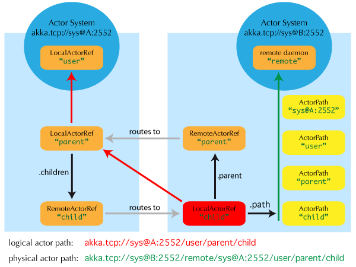

# Actor引用,路径和地址

This chapter describes how actors are identified and located within a possibly distributed actor system. It ties into the central idea that @ref:[Actor Systems](actor-systems.md) form intrinsic supervision hierarchies as well as that
communication between actors is transparent with respect to their placement across multiple network nodes.

本章介绍了演员如何在可能分布的演员系统中进行识别和定位。它涉及到[Actor系统](https://doc.akka.io/docs/akka/current/general/actor-systems.html)形成内在监督层次结构的中心思想，以及参与者之间的沟通对于他们在多个网络节点中的位置是透明的。


The above image displays the relationship between the most important entities within an actor system, please read on for the details.

上图显示了演员系统中最重要的实体之间的关系，请详细阅读。

## Actor引用是什么?

An actor reference is a subtype of `ActorRef`, whose foremost purpose is to support sending messages to the actor it represents. Each actor has access to its canonical (local) reference through the `self` field; this
reference is also included as sender reference by default for all messages sent to other actors. Conversely, during message processing the actor has access to a reference representing the sender of the current message through the `sender()` method.

参与者引用是其子类型`ActorRef`，其最重要的目的是支持向其表示的参与者发送消息。每个演员都可以通过该`self`领域获得其规范（本地）参考; 对于发送给其他参与者的所有消息，此引用也默认作为发件人参考。相反，在消息处理期间，参与者可以通过该`sender()`方法访问表示当前消息的发送者的引用。

There are several different types of actor references that are supported depending on the configuration of the actor system:

根据角色系统的配置，支持多种不同类型的角色引用：

 * Purely local actor references are used by actor systems which are not configured to support networking functions. These actor references will not function if sent across a network connection to a remote JVM.
 * 纯粹的本地参与者参与者被未被配置为支持联网功能的参与者系统使用。如果通过网络连接发送到远程JVM，这些参与者引用将不起作用。
 * Local actor references when remoting is enabled are used by actor systems which support networking functions for those references which represent actors within the same JVM. In order to also be reachable when sent to other network nodes, these references include protocol and remote addressing
  information.
 * 启用远程处理时的本地参与者引用由参与者系统使用，该参与者支持表示同一JVM内参与者的参考的联网功能。为了在发送到其他网络节点时也可以访问，这些参考包括协议和远程寻址信息。
 * There is a subtype of local actor references which is used for routers (i.e.actors mixing in the `Router` trait). Its logical structure is the same as for the aforementioned local references, but sending a message to them dispatches to one of their children directly instead.
 * 有一个本地参与者的子类型用于路由器（即演员混合的`Router`特质）。其逻辑结构与前述的本地引用相同，但发送消息直接发送给其子中的一个子代。
 * Remote actor references represent actors which are reachable using remote communication, i.e. sending messages to them will serialize the messages transparently and send them to the remote JVM.
 * 远程参与者引用代表使用远程通信可访问的参与者，即向他们发送消息将透明地序列化消息并将消息发送给远程JVM。
 * There are several special types of actor references which behave like local actor references for all practical purposes:
 * 出于各种实际目的，有几种特殊类型的参与者参考行为类似于本地参与者参考：
   * `PromiseActorRef` is the special representation of a `Promise` for the purpose of being completed by the response from an actor. `akka.pattern.ask` creates this actor reference.
   * `PromiseActorRef`是`Promise`为了通过演员的回应完成的a的特殊表示。`akka.pattern.ask`创建这个actor参考。
   * `DeadLetterActorRef` is the default implementation of the dead letters service to which Akka routes all messages whose destinations are shut down or non-existent.
   * `DeadLetterActorRef` 是Akka向其关闭目的地或不存在的所有消息发送的死信服务的默认实现。
   * `EmptyLocalActorRef` is what Akka returns when looking up a non-existent local actor path: it is equivalent to a `DeadLetterActorRef`, but it retains its path so that Akka can send it over the network and compare it to other existing actor references for that path, some of which might have been obtained before the actor died.
   * `EmptyLocalActorRef`是Akka在查找不存在的本地演员路径时返回的内容：它等同于a `DeadLetterActorRef`，但它保留其路径，以便Akka可以通过网络发送它并将其与该路径的其他现有actor参考进行比较，其中一些参考可能是在演员死亡之前获得的。
 * And then there are some one-off internal implementations which you should never really see:
 * 然后有一些你永远不会看到的一次性内部实现：
   * There is an actor reference which does not represent an actor but acts only as a pseudo-supervisor for the root guardian, we call it “the one who walks the bubbles of space-time”.
   * 有一个演员的参考资料不代表演员，但只作为根监护人的伪监督者，我们称之为“走过时空泡沫的人”。
   * The first logging service started before actually firing up actor creation facilities is a fake actor reference which accepts log events and prints them directly to standard output; it is `Logging.StandardOutLogger`.
   * 在实际启动actor创建设施之前启动的第一个日志记录服务是假的actor参考，它接受日志事件并将它们直接打印到标准输出; 它是`Logging.StandardOutLogger`。

## Actor路径是什么?

Since actors are created in a strictly hierarchical fashion, there exists a unique sequence of actor names given by recursively following the supervision links between child and parent down towards the root of the actor system. This sequence can be seen as enclosing folders in a file system, hence we adopted the name “path” to refer to it, although actor hierarchy has some fundamental difference from file system hierarchy.

由于演员是以严格等级的方式创建的，因此存在一系列独特的演员姓名，这些演员姓名是通过递归地跟随儿童和父母之间的监督链接向下演员系统的根源而给出的。这个序列可以看作是将文件夹包含在一个文件系统中，因此我们采用名称“path”来引用它，尽管actor层次结构与文件系统层次结构有一些根本的区别。

An actor path consists of an anchor, which identifies the actor system,followed by the concatenation of the path elements, from root guardian to the designated actor; the path elements are the names of the traversed actors and are separated by slashes.

一个演员路径由一个锚点组成，该锚点标识演员系统，然后是从根监护人到指定演员的路径元素的连接; 路径元素是遍历actor的名称，并用斜杠分隔。

### Actor引用和路径的区别?

An actor reference designates a single actor and the life-cycle of the reference matches that actor’s life-cycle; an actor path represents a name which may or may not be inhabited by an actor and the path itself does not have a life-cycle,it never becomes invalid. You can create an actor path without creating an actor,
but you cannot create an actor reference without creating corresponding actor.

演员参考指定单个演员，参考的生命周期与演员的生命周期匹配; 演员路径表示可能会或可能不会被演员居住的名称，而路径本身没有生命周期，它永远不会失效。您可以创建演员路径而不创建演员，但不能创建演员参考而不创建相应的演员。

You can create an actor, terminate it, and then create a new actor with the same actor path. The newly created actor is a new incarnation of the actor. It is not the same actor. An actor reference to the old incarnation is not valid for the new incarnation. Messages sent to the old actor reference will not be delivered to the new incarnation even though they have the same path.

您可以创建一个actor，终止它，然后使用相同的actor路径创建一个新的actor。新创建的演员是演员的新角色。这不是同一个演员。一个演员参考旧的化身不适用于新的化身。发送给旧演员参考的消息即使具有相同的路径，也不会传递给新的演员。

### Actor路径锚点

Each actor path has an address component, describing the protocol and location by which the corresponding actor is reachable, followed by the names of the actors in the hierarchy from the root up. Examples are:

每个参与者路径都有一个地址组件，描述相应参与者可访问的协议和位置，后面跟随从层次结构中参与者的名称。例子是：

```
"akka://my-sys/user/service-a/worker1"                   // purely local
"akka.tcp://my-sys@host.example.com:5678/user/service-b" // remote
```

Here, `akka.tcp` is the default remote transport for the 2.4 release; other transports are pluggable.The interpretation of the host and port part (i.e. `host.example.com:5678` in the example) depends on the transport mechanism used, but it must abide by the URI structural rules.

这里`akka.tcp`是2.4版本的默认远程传输; 其他传输是可插拔的。主机和端口部分（`host.example.com:5678`例如）的解释取决于使用的传输机制，但它必须遵守URI结构规则。

### 逻辑Actor路径

The unique path obtained by following the parental supervision links towards the root guardian is called the logical actor path. This path matches exactly the creation ancestry of an actor, so it is completely deterministic as soon as the actor system’s remoting configuration (and with it the address component of
the path) is set.

通过遵循家长监督环节向根监护人获得的独特路径被称为逻辑行为者路径。该路径完全匹配actor的创建祖先，因此只要actor系统的远程配置（并且使用该路径的地址组件）被设置，它就完全是确定性的。

### 物理Actor路径

While the logical actor path describes the functional location within one actor system, configuration-based remote deployment means that an actor may be created on a different network host than its parent, i.e. within a different actor system. In this case, following the actor path from the root guardian up entails traversing the network, which is a costly operation. Therefore, each actor also has a physical path, starting at the root guardian of the actor system where the actual actor object resides. Using this path as sender reference when querying other actors will let them reply directly to this actor, minimizing delays incurred by routing.

虽然逻辑参与者路径描述了一个参与者系统内的功能位置，但基于配置的远程部署意味着参与者可以在与其父系不同的网络主机上创建，即在不同的参与者系统内创建。在这种情况下，跟随来自根监护人的参与者路径需要穿越网络，这是一种代价高昂的操作。因此，每个角色都有一个物理路径，从实际角色对象所在角色系统的根监护人开始。在查询其他参与者时使用此路径作为发件人参考将让他们直接回复此参与者，从而最大限度地减少由路由引发的延迟。

One important aspect is that a physical actor path never spans multiple actor systems or JVMs. This means that the logical path (supervision hierarchy) and the physical path (actor deployment) of an actor may diverge if one of its ancestors is remotely supervised.

一个重要方面是物理角色路径从不跨越多个角色系统或JVM。这意味着如果一位演员的祖先被远程监督，则演员的逻辑路径（监督层级）和物理路径（演员部署）可能会发生分歧。

### Actor路径别名和符号链接?

As in some real file-systems you might think of a “path alias” or “symbolic link” for an actor, i.e. one actor may be reachable using more than one path. However, you should note that actor hierarchy is different from file system hierarchy. You cannot freely create actor paths like symbolic links to refer to arbitrary actors. As described in the above logical and physical actor path sections, an actor path must be either logical path which represents supervision hierarchy, or physical path which represents actor deployment.

正如在一些真实的文件系统中，你可能会想到一个演员的“路径别名”或“符号链接”，即一个演员可能使用多条路径到达。但是，您应该注意，actor层次结构与文件系统层次结构不同。你不能自由地创建像符号链接那样的actor路径来引用任意actor。如上述逻辑和物理参与者路径部分所述，参与者路径必须是表示监督层次结构的逻辑路径，或者表示参与者部署的物理路径。

## 如何获得Actor引用?

There are two general categories to how actor references may be obtained: by creating actors or by looking them up, where the latter functionality comes in the two flavours of creating actor references from concrete actor paths and querying the logical actor hierarchy.

关于如何获得角色引用有两个一般类别：创建角色或者查看角色，后者的功能来自于从具体角色路径创建角色引用和查询逻辑角色层次结构的两种风格。

### 创建Actors

An actor system is typically started by creating actors beneath the guardian actor using the `ActorSystem.actorOf` method and then using `ActorContext.actorOf` from within the created actors to spawn the actor tree. These methods return a reference to the newly created actor. Each actor has direct access (through its `ActorContext`) to references for its parent,itself and its children. These references may be sent within messages to other actors,enabling those to reply directly.

演员系统通常通过使用该`ActorSystem.actorOf`方法在监护人演员下创建演员开始，然后`ActorContext.actorOf`在创建的演员中使用以产生演员树。这些方法返回对新创建的actor的引用。每个演员都可以直接访问（通过它`ActorContext`）参考其父，本身及其子女。这些引用可以在消息内发送给其他角色，使他们能够直接回复。

### 通过具体路径查找Actor

In addition, actor references may be looked up using the `ActorSystem.actorSelection` method. The selection can be used for communicating with said actor and the actor corresponding to the selection
is looked up when delivering each message.

另外，可以使用该`ActorSystem.actorSelection`方法查看演员引用。该选择可以用于与所述演员进行通信，并且在传递每个消息时查找与该选择对应的演员。

To acquire an `ActorRef` that is bound to the life-cycle of a specific actor you need to send a message, such as the built-in `Identify` message, to the actor and use the `sender()` reference of a reply from the actor.

要获取与`ActorRef`特定演员的生命周期绑定的演员，您需要向演员发送消息（例如内置`Identify`消息），并使用演员`sender()`的答复参考。

#### 绝对路径和相对路径

In addition to `ActorSystem.actorSelection` there is also `ActorContext.actorSelection`, which is available inside any actor as `context.actorSelection`. This yields an actor selection much like its twin on
`ActorSystem`, but instead of looking up the path starting from the root of the actor tree it starts out on the current actor. Path elements consisting of two dots (`".."`) may be used to access the parent actor. You can for example send a message to a specific sibling:

除此之外，`ActorSystem.actorSelection`还有`ActorContext.actorSelection`，这在任何演员中都是可用的`context.actorSelection`。这产生了一个很像其双胞胎的演员选择`ActorSystem`，但不是从演员树的根部开始查找从当前演员开始的路径。包含两个点（`".."`）的路径元素可用于访问父级角色。例如，您可以将消息发送给特定的兄弟姐妹：

```
context.actorSelection("../brother") ! msg
```

Absolute paths may of course also be looked up on *context* in the usual way, i.e.

绝对路径也可以通常的方式在*上下文*中查找，即

```scala
context.actorSelection("/user/serviceA") ! msg
```

will work as expected.

将按预期工作。

### 查询逻辑Actor层次结构

Since the actor system forms a file-system like hierarchy, matching on paths is possible in the same way as supported by Unix shells: you may replace (parts of) path element names with wildcards (*«*»* and *«?»*) to formulate a selection which may match zero or more actual actors. Because the result is not a single actor reference, it has a different type `ActorSelection` and does not support the full set of operations an `ActorRef` does.Selections may be formulated using the `ActorSystem.actorSelection` and
`ActorContext.actorSelection` methods and do support sending messages:

由于参与者系统构成层次结构的文件系统，路径匹配可能与Unix shell支持的方式相同：可以用通配符（*«*»*和*«？»*）替换（部分路径元素名称）制定可能与零个或多个实际参与者相匹配的选择。由于结果不是单个参与者，因此它具有不同的类型`ActorSelection`，并且不支持完整的操作集`ActorRef`。选择可以使用`ActorSystem.actorSelection`和`ActorContext.actorSelection`方法制定，并支持发送消息：

```
context.actorSelection("../*") ! msg
```

will send *msg* to all siblings including the current actor. As for references obtained using *actorSelection*, a traversal of the supervision hierarchy is done in order to perform the message send. As the exact set of  actors which match a selection may change even while a message is making its way to the recipients,it is not possible to watch a selection for liveliness changes. In order to do that, resolve the uncertainty by sending a request and gathering all answers,extracting the sender references, and then watch all discovered concrete actors. This scheme of resolving a selection may be improved upon in a future release.

会发送*消息*给所有兄弟姐妹，包括当前的演员。至于使用*actorSelection*获得的引用，为了执行消息发送，遍历监督层次结构。由于即使消息正在向收件人发送，与选择相匹配的演员的确切组合也可能会发生变化，因此无法观看选择是否存在活跃度变化。为此，通过发送请求并收集所有答案来解决不确定性，提取发件人引用，然后观察所有发现的具体参与者。这种解决选择的方案可能在将来的版本中得到改进。

<a id="actorof-vs-actorselection"></a>
### Summary: `actorOf` vs. `actorSelection`

@@@ note

What the above sections described in some detail can be summarized and memorized easily as follows:

 * `actorOf` only ever creates a new actor, and it creates it as a direct child of the context on which this method is invoked (which may be any actor or actor system).
 * `actorSelection` only ever looks up existing actors when messages are delivered, i.e. does not create actors, or verify existence of actors when the selection is created.

@@@

## Actor Reference and Path Equality

Equality of `ActorRef` match the intention that an `ActorRef` corresponds to the target actor incarnation. Two actor references are compared equal when they have the same path and point to the same actor incarnation. A reference pointing to a terminated actor does not compare equal to a reference pointing to another (re-created) actor with the same path. Note that a restart of an actor caused by a failure still means that it is the same actor incarnation, i.e. a restart is not visible for the consumer of the `ActorRef`.

If you need to keep track of actor references in a collection and do not care about the exact actor incarnation you can use the `ActorPath` as key, because the identifier of the target actor is not taken into account when comparing actor paths.

## Reusing Actor Paths

When an actor is terminated, its reference will point to the dead letter mailbox,DeathWatch will publish its final transition and in general it is not expected to come back to life again (since the actor life cycle does not allow this). While it is possible to create an actor at a later time with an identical path—simply due to it being impossible to enforce the opposite without keeping the set of all actors ever created available—this is not good practice:  messages sent with `actorSelection` to an actor which “died” suddenly start to work
again, but without any guarantee of ordering between this transition and any other event, hence the new inhabitant of the path may receive messages which were destined for the previous tenant.

It may be the right thing to do in very specific circumstances, but make sure to confine the handling of this precisely to the actor’s supervisor, because that is the only actor which can reliably detect proper deregistration of the name, before which creation of the new child will fail.

It may also be required during testing, when the test subject depends on being instantiated at a specific path. In that case it is best to mock its supervisor so that it will forward the Terminated message to the appropriate point in the test procedure, enabling the latter to await proper deregistration of the name.

## The Interplay with Remote Deployment

When an actor creates a child, the actor system’s deployer will decide whether the new actor resides in the same JVM or on another node. In the second case, creation of the actor will be triggered via a network connection to happen in a different JVM and consequently within a different actor system. The remote
system will place the new actor below a special path reserved for this purpose and the supervisor of the new actor will be a remote actor reference (representing that actor which triggered its creation). In this case, `context.parent` (the supervisor reference) and `context.path.parent` (the parent node in the actor’s path) do not represent the same actor. However, looking up the child’s name within the supervisor will find it on the remote node, preserving logical structure e.g. when sending to an unresolved actor reference.



## What is the Address part used for?

When sending an actor reference across the network, it is represented by its path. Hence, the path must fully encode all information necessary to send messages to the underlying actor. This is achieved by encoding protocol, host and port in the address part of the path string. When an actor system receives
an actor path from a remote node, it checks whether that path’s address matches the address of this actor system, in which case it will be resolved to the actor’s local reference. Otherwise, it will be represented by a remote actor reference.

<a id="toplevel-paths"></a>
## Top-Level Scopes for Actor Paths

At the root of the path hierarchy resides the root guardian above which all other actors are found; its name is `"/"`. The next level consists of the following:

 * `"/user"` is the guardian actor for all user-created top-level actors;actors created using `ActorSystem.actorOf` are found below this one.
 * `"/system"` is the guardian actor for all system-created top-level actors,e.g. logging listeners or actors automatically deployed by configuration at the start of the actor system.
 * `"/deadLetters"` is the dead letter actor, which is where all messages sent to stopped or non-existing actors are re-routed (on a best-effort basis: messages may be lost even within the local JVM).
 * `"/temp"` is the guardian for all short-lived system-created actors, e.g.those which are used in the implementation of `ActorRef.ask`.
 * `"/remote"` is an artificial path below which all actors reside whose supervisors are remote actor references

The need to structure the name space for actors like this arises from a central and very simple design goal: everything in the hierarchy is an actor, and all actors function in the same way. Hence you can not only look up the actors you created, you can also look up the system guardian and send it a message (which
it will dutifully discard in this case). This powerful principle means that there are no quirks to remember, it makes the whole system more uniform and consistent.

If you want to read more about the top-level structure of an actor system, have a look at @ref:[The Top-Level Supervisors](supervision.md#toplevel-supervisors).