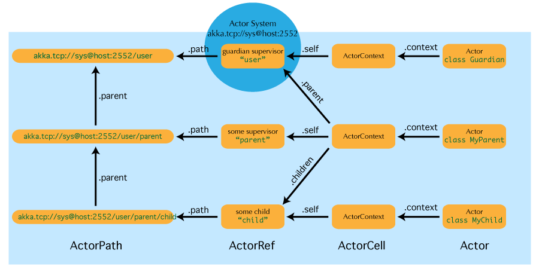

# Actor引用,路径和地址

This chapter describes how actors are identified and located within a possibly distributed actor system. It ties into the central idea that @ref:[Actor Systems](actor-systems.md) form intrinsic supervision hierarchies as well as that
communication between actors is transparent with respect to their placement across multiple network nodes.

本章介绍了是如何在可能是分布式形态的Actor系统中进行识别和定位Actor的。它涉及到[Actor系统](https://doc.akka.io/docs/akka/current/general/actor-systems.html)形成内在监督层次结构的中心思想，以及Actor间通讯对于他们在多个网络中位置的透明性。



The above image displays the relationship between the most important entities within an actor system, please read on for the details.

上图显示了Actor系统中最重要的实体之间的关系，请详细阅读。

## Actor引用是什么?

An actor reference is a subtype of `ActorRef`, whose foremost purpose is to support sending messages to the actor it represents. Each actor has access to its canonical (local) reference through the `self` field; this
reference is also included as sender reference by default for all messages sent to other actors. Conversely, during message processing the actor has access to a reference representing the sender of the current message through the `sender()` method.

Actor引用是`ActorRef`的子类型，其最重要的目的是支持向其代表的Actor发送消息。每个Actor都可以通过`self`字段获得规范（本地）的引用; 对于发送给其他Actor的消息，此引用也默认作为发件人引用。相反，在消息处理过程中，Actor可以通过`sender()`方法访问代表当前消息发送者的引用。

There are several different types of actor references that are supported depending on the configuration of the actor system:

根据Actor系统的配置，系统支持多种不同类型的Actor引用：

 * Purely local actor references are used by actor systems which are not configured to support networking functions. These actor references will not function if sent across a network connection to a remote JVM.
 * 未配置网络功能的Actor系统中的单纯的本地Actor引用。如果这些引用通过网络被发送到远程JVM上，那这些Actor引用将不起作用。
 * Local actor references when remoting is enabled are used by actor systems which support networking functions for those references which represent actors within the same JVM. In order to also be reachable when sent to other network nodes, these references include protocol and remote addressing
    information.
 * 配置了网络功能的Actor系统中的本地Actor引用，其中Remoting功能为同一个JVM中的Actor提供了网络能力支持。为了Actor引用在被发送到其他网络节点后也能被访问，这些引用包含了协议和远程寻址信息。
 * There is a subtype of local actor references which is used for routers (i.e.actors mixing in the `Router` trait). Its logical structure is the same as for the aforementioned local references, but sending a message to them dispatches to one of their children directly instead.
 * 用于路由（Actor混入了`Router`特质）的本地Actor引用的子类型。其逻辑结构与之前描述的本地引用相同，但其接收的信息会被分发到其中的一个子级身上。
 * Remote actor references represent actors which are reachable using remote communication, i.e. sending messages to them will serialize the messages transparently and send them to the remote JVM.
 * 代表远程通信可访问到的远程Actor的引用，即向他们发送消息时，将透明地序列化消息，并将消息发送给远程JVM。
 * There are several special types of actor references which behave like local actor references for all practical purposes:
 * 出于某种实际的目的，有几种特殊类型的Actor引用，其行为类似于本地Actor引用：
   * `PromiseActorRef` is the special representation of a `Promise` for the purpose of being completed by the response from an actor. `akka.pattern.ask` creates this actor reference.
   * `PromiseActorRef`是为获取Actor响应完成结果而产生的特殊`Promise`表示。这个Actor引用是由`akka.pattern.ask`创建的。
   * `DeadLetterActorRef` is the default implementation of the dead letters service to which Akka routes all messages whose destinations are shut down or non-existent.
   * `DeadLetterActorRef` 是死信服务的默认实现，当消息被发往已经关闭或不存在的Actor时，Akka会将消息路由到死信信箱中。
   * `EmptyLocalActorRef` is what Akka returns when looking up a non-existent local actor path: it is equivalent to a `DeadLetterActorRef`, but it retains its path so that Akka can send it over the network and compare it to other existing actor references for that path, some of which might have been obtained before the actor died.
   * `EmptyLocalActorRef`是当Akka在查找不存在的本地Actor路径时返回的对象：它等同于 `DeadLetterActorRef`，但它保留了路径，以便Akka可以将其传递至网络中，将其比作该路径下的存在的Actor，就像该引用可能是在Actor死亡之前获取的那样(**自行理解！！**)。
 * And then there are some one-off internal implementations which you should never really see:
 * 然后有一些你应该永远不会看到的一次性内部实现：
   * There is an actor reference which does not represent an actor but acts only as a pseudo-supervisor for the root guardian, we call it “the one who walks the bubbles of space-time”.
   * 有一个Actor的引用不代表Actor，但只作为根监督者的伪上级监督者，我们称之为“时空泡沫行者”。
   * The first logging service started before actually firing up actor creation facilities is a fake actor reference which accepts log events and prints them directly to standard output; it is `Logging.StandardOutLogger`.
   * 在实际启动Actor创建设施之前启动的第一个日志服务是假的Actor引用，它接受日志事件并将它们直接打印到标准输出; 它是`Logging.StandardOutLogger`。

## Actor路径是什么?

Since actors are created in a strictly hierarchical fashion, there exists a unique sequence of actor names given by recursively following the supervision links between child and parent down towards the root of the actor system. This sequence can be seen as enclosing folders in a file system, hence we adopted the name “path” to refer to it, although actor hierarchy has some fundamental difference from file system hierarchy.

由于Actor是以严格层级的方式创建的，因此存在一系列唯一的Actor名称，这些Actor名称是从根开始往下，根据监督路线递归给出的。这个序列可以看作是文件系统中的文件夹，因此尽管Actor的层级结构与文件系统的层级结构有一些根本的区别，但我们仍可以采用“path”来描述它，。

An actor path consists of an anchor, which identifies the actor system,followed by the concatenation of the path elements, from root guardian to the designated actor; the path elements are the names of the traversed actors and are separated by slashes.

一个Actor路径包含一个锚点，该锚点标识了Actor系统，然后是从根监督者到指定Actor的路径元素的连接; 路径元素是从头到尾的Actor的名称，并用"/"分隔。

### Actor引用和路径的区别?

An actor reference designates a single actor and the life-cycle of the reference matches that actor’s life-cycle; an actor path represents a name which may or may not be inhabited by an actor and the path itself does not have a life-cycle,it never becomes invalid. You can create an actor path without creating an actor,
but you cannot create an actor reference without creating corresponding actor.

一个Actor引用指定单个Actor，引用的生命周期与Actor的生命周期一致; Actor路径代表一个位置的名称，这个位置可能有也可能没有Actor占据，路径本身没有生命周期，它永远不会失效。你可以脱离了Actor去创建Actor路径，但你不能脱离了引用去创建Actor。

You can create an actor, terminate it, and then create a new actor with the same actor path. The newly created actor is a new incarnation of the actor. It is not the same actor. An actor reference to the old incarnation is not valid for the new incarnation. Messages sent to the old actor reference will not be delivered to the new incarnation even though they have the same path.

你可以创建一个Actor，然后终止它，然后使用相同的Actor路径创建一个新的Actor。新创建的Actor是新的化身。这不是同一个Actor。一个Actor旧化身的引用不适用于新的化身。发送给旧Actor引用的消息，即使具有相同的路径也不会传递给新的化身。

### Actor路径锚点

Each actor path has an address component, describing the protocol and location by which the corresponding actor is reachable, followed by the names of the actors in the hierarchy from the root up. Examples are:

每个Actor路径都有一个地址组件，描述相应Actor可访问的协议和位置，后面跟着层次结构中Actor的名称。例子如下：

```
"akka://my-sys/user/service-a/worker1"                   // purely local
"akka.tcp://my-sys@host.example.com:5678/user/service-b" // remote
```

Here, `akka.tcp` is the default remote transport for the 2.4 release; other transports are pluggable.The interpretation of the host and port part (i.e. `host.example.com:5678` in the example) depends on the transport mechanism used, but it must abide by the URI structural rules.

这里`akka.tcp`是2.4版本的默认远程传输协议; 其他传输协议是插件式的。主机和端口部分（例如`host.example.com:5678`）的解析取决于使用的传输机制，但它必须遵守URI结构规则。

### 逻辑Actor路径

The unique path obtained by following the parental supervision links towards the root guardian is called the logical actor path. This path matches exactly the creation ancestry of an actor, so it is completely deterministic as soon as the actor system’s remoting configuration (and with it the address component of
the path) is set.

通过按照父级监督者指向根监督者的方式获得的唯一路径被称为逻辑Actor路径。该路径完全匹配Actor的创建血缘路径，因此只要Actor系统的remoting配置被设置，它就是完全确定的。

### 物理Actor路径

While the logical actor path describes the functional location within one actor system, configuration-based remote deployment means that an actor may be created on a different network host than its parent, i.e. within a different actor system. In this case, following the actor path from the root guardian up entails traversing the network, which is a costly operation. Therefore, each actor also has a physical path, starting at the root guardian of the actor system where the actual actor object resides. Using this path as sender reference when querying other actors will let them reply directly to this actor, minimizing delays incurred by routing.

虽然逻辑Actor路径描述了一个Actor系统内的功能位置，但基于配置的远程部署意味着Actor可以在与其父系不同的网络主机上创建，即在不同的Actor系统内创建。在这种情况下，从根监督者开始的Actor路径需要穿越网络，这是一种代价高昂的操作。因此，每个Actor都有一个物理路径，从实际Actor对象所在Actor系统的根监督者开始。在查询其他Actor时使用此路径作为发件人引用将让他们直接回复此Actor，从而最大限度地减少由路由引发的延迟。

One important aspect is that a physical actor path never spans multiple actor systems or JVMs. This means that the logical path (supervision hierarchy) and the physical path (actor deployment) of an actor may diverge if one of its ancestors is remotely supervised.

一个重要方面是物理Actor路径从不跨越多个Actor系统或JVM。这意味着如果一个Actor的祖先被远程监督着，则Actor的逻辑路径（监督层级）和物理路径（Actor部署）可能会有分歧。

### Actor路径别名和符号链接?

As in some real file-systems you might think of a “path alias” or “symbolic link” for an actor, i.e. one actor may be reachable using more than one path. However, you should note that actor hierarchy is different from file system hierarchy. You cannot freely create actor paths like symbolic links to refer to arbitrary actors. As described in the above logical and physical actor path sections, an actor path must be either logical path which represents supervision hierarchy, or physical path which represents actor deployment.

正如在一些真实的文件系统中，你可能会想到一个Actor的“路径别名”或“符号链接”，即一个Actor可能会通过多条路径触达。但是，您应该注意，Actor层次结构与文件系统层次结构不同。你不能自由地创建像符号链接那样的Actor路径来引用Actor。如上面逻辑路径和物理路径部分所述，Actor路径必须是表示监督层次的逻辑路径，或者是表示部署的物理路径。

## 如何获得Actor引用?

There are two general categories to how actor references may be obtained: by creating actors or by looking them up, where the latter functionality comes in the two flavours of creating actor references from concrete actor paths and querying the logical actor hierarchy.

有两类方法可以获取Actor的引用：创建Actor或者查找Actor，后者通过以具体Actor路径创建Actor引用和通过查询逻辑Actor层级两种方式实现。

### 创建Actors

An actor system is typically started by creating actors beneath the guardian actor using the `ActorSystem.actorOf` method and then using `ActorContext.actorOf` from within the created actors to spawn the actor tree. These methods return a reference to the newly created actor. Each actor has direct access (through its `ActorContext`) to references for its parent,itself and its children. These references may be sent within messages to other actors,enabling those to reply directly.

Actor系统通常以使用`ActorSystem.actorOf`方法在监督者Actor下创建Actor来作为第一步，然后使用`ActorContext.actorOf`方法在创建的Actor中扩展Actor树。这些方法返回对新创建的Actor的引用。每个Actor都可以直接访问（通过`ActorContext`）其父级，其本身，其子级。这些引用可以被封装在消息里发送给其他Actor，使他们能够直接利用这些引用进行回复。

### 通过具体路径查找Actor

In addition, actor references may be looked up using the `ActorSystem.actorSelection` method. The selection can be used for communicating with said actor and the actor corresponding to the selection
is looked up when delivering each message.

另外，可以使用`ActorSystem.actorSelection`方法查找Actor引用。该查询结果可以用于与所述Actor进行通信，并且在传递消息时，该查询对应的Actor就已经查找出来了。

To acquire an `ActorRef` that is bound to the life-cycle of a specific actor you need to send a message, such as the built-in `Identify` message, to the actor and use the `sender()` reference of a reply from the actor.

要获取与特定Actor的生命周期绑定的`ActorRef`，你需要向那特定Actor发送消息（例如内置的`Identify`消息），并使用回复中的`sender()`作为其引用。

#### 绝对路径和相对路径

In addition to `ActorSystem.actorSelection` there is also `ActorContext.actorSelection`, which is available inside any actor as `context.actorSelection`. This yields an actor selection much like its twin on
`ActorSystem`, but instead of looking up the path starting from the root of the actor tree it starts out on the current actor. Path elements consisting of two dots (`".."`) may be used to access the parent actor. You can for example send a message to a specific sibling:

除了`ActorSystem.actorSelection`方法之外还有`ActorContext.actorSelection`方法，这在任何Actor中都能通过`context.actorSelection`方法使用。这个很像`ActorSystem`，但不是从Actor树的根部开始查找，而是从当前Actor开始。包含两个点（`".."`）的路径可用于访问父级Actor。例如，你可以将消息发送给特定的兄弟姐妹：

```
context.actorSelection("../brother") ! msg
```

Absolute paths may of course also be looked up on *context* in the usual way, i.e.

绝对路径也可以以通常的方式在*上下文*中查找，即

```scala
context.actorSelection("/user/serviceA") ! msg
```

will work as expected.

将按预期那样。

### 查询逻辑Actor层次结构

Since the actor system forms a file-system like hierarchy, matching on paths is possible in the same way as supported by Unix shells: you may replace (parts of) path element names with wildcards (*«*»* and *«?»*) to formulate a selection which may match zero or more actual actors. Because the result is not a single actor reference, it has a different type `ActorSelection` and does not support the full set of operations an `ActorRef` does.Selections may be formulated using the `ActorSystem.actorSelection` and
`ActorContext.actorSelection` methods and do support sending messages:

由于Actor系统构成了类似文件系统的层次结构，所以路径匹配可以采用类似Unix shell的方式：可以用通配符（*«\*»*和*«？»*）替换（部分）路径元素名称，这样可以提供零个或多个结果的查询。由于结果不是单个Actor，因此它的结果是`ActorSelection`类型，这与`ActorRef`不同，同时也不能在结果集上做`ActorRef`那样的操作。可以使用`ActorSystem.actorSelection`和`ActorContext.actorSelection`方法制定查询，其结果支持发送消息：

```
context.actorSelection("../*") ! msg
```

will send *msg* to all siblings including the current actor. As for references obtained using *actorSelection*, a traversal of the supervision hierarchy is done in order to perform the message send. As the exact set of  actors which match a selection may change even while a message is making its way to the recipients,it is not possible to watch a selection for liveliness changes. In order to do that, resolve the uncertainty by sending a request and gathering all answers,extracting the sender references, and then watch all discovered concrete actors. This scheme of resolving a selection may be improved upon in a future release.

这会发送*消息*给所有兄弟姐妹，也包括当前的Actor。由于通过actorSelection获得引用，为了执行消息的发送，需要进行监督层次的遍历。由于即使消息正在发向收件Actor，与查询匹配的Actor也可能会发生变化，因此无法监视查询结果的生命活动变化。为此，通过发送请求并收集所有回复来解决不确定性，提取回复人的引用，然后监视所有发现的具体Actor。这种解决方案可能在将来的版本中得到改进。

<a id="actorof-vs-actorselection"></a>
### 总结: `actorOf` vs. `actorSelection`

@@@ note

What the above sections described in some detail can be summarized and memorized easily as follows:

以上部分详细描述的内容可以总结和记忆如下：

 * `actorOf` only ever creates a new actor, and it creates it as a direct child of the context on which this method is invoked (which may be any actor or actor system).
 * `actorOf` 只创建一个新的Actor，并将该Actor创建为调用此方法的上下文的直接子元素（可能是任何Actor或Actor系统）。
 * `actorSelection` only ever looks up existing actors when messages are delivered, i.e. does not create actors, or verify existence of actors when the selection is created.
 * `actorSelection` 只有在传递消息时才查找现有的Actor，它不创建Actor，也不在查询创建时验证Actor的存在性。

@@@

## Actor引用和路径平等

Equality of `ActorRef` match the intention that an `ActorRef` corresponds to the target actor incarnation. Two actor references are compared equal when they have the same path and point to the same actor incarnation. A reference pointing to a terminated actor does not compare equal to a reference pointing to another (re-created) actor with the same path. Note that a restart of an actor caused by a failure still means that it is the same actor incarnation, i.e. a restart is not visible for the consumer of the `ActorRef`.

`ActorRef`是否相等可以从`ActorRef`对应的目标Actor的化身去判断。当两个Actor引用具有相同的路径并且指向相同的Actor化身时，它们是相等的。但指向已终止的Actor的引用和指向相同路径的另一个（重新创建的）Actor的引用是不等的。请注意，由失败引起重启的Actor仍然是同一个Actor的化身，即重启对于`ActorRef`的使用者来说是不可见的。

If you need to keep track of actor references in a collection and do not care about the exact actor incarnation you can use the `ActorPath` as key, because the identifier of the target actor is not taken into account when comparing actor paths.

如果你需要跟踪集合中的Actor引用，并且不关心具体的Actor化身，那么你可以使用`ActorPath`作为关键字，因为在比较Actor路径时不会考虑目标Actor的具体身份的。

## 重用Actor路径

When an actor is terminated, its reference will point to the dead letter mailbox,DeathWatch will publish its final transition and in general it is not expected to come back to life again (since the actor life cycle does not allow this). While it is possible to create an actor at a later time with an identical path—simply due to it being impossible to enforce the opposite without keeping the set of all actors ever created available—this is not good practice:  messages sent with `actorSelection` to an actor which “died” suddenly start to work
again, but without any guarantee of ordering between this transition and any other event, hence the new inhabitant of the path may receive messages which were destined for the previous tenant.

当Actor被终止时，其引用将指向死信信箱，`DeathWatch`将公布它的最终转变，而且这个Actor通常不会复生（因为Actor生命周期不允许这样做）。虽然可能稍后会以相同的路径创建一个新Actor，因为如果不能保持所有创建的Actor都可用，就不可能强制执行反向操作(**这说的什么鬼？？？**)，这是不好的做法：通过`actorSelection`给Actor发消息，这个Actor之前死了，但又突然开始工作，在这个转变和其他事件之间无法保证任何顺序，因此这个新的化身可能会收到发往前一个化身的信息。

It may be the right thing to do in very specific circumstances, but make sure to confine the handling of this precisely to the actor’s supervisor, because that is the only actor which can reliably detect proper deregistration of the name, before which creation of the new child will fail.

也许在非常特殊的情况下做这件事是对的，但是确保将这个处理限制在Actor的监督者身上，因为那是唯一可以检测到正确的名称注销行为的Actor，在那之前新子级的创建将会失败(**草草草!!!!**)。

It may also be required during testing, when the test subject depends on being instantiated at a specific path. In that case it is best to mock its supervisor so that it will forward the Terminated message to the appropriate point in the test procedure, enabling the latter to await proper deregistration of the name.

在测试期间也是，当测试对象依赖于在特定路径上的实例化时。在这种情况下，最好设置虚拟监督者，以便在测试过程中它能将终止消息转发到适当位置，使后者能够恰当地注销该名称(**草草草!!!!**)。

## 远程部署之间的相互影响

When an actor creates a child, the actor system’s deployer will decide whether the new actor resides in the same JVM or on another node. In the second case, creation of the actor will be triggered via a network connection to happen in a different JVM and consequently within a different actor system. The remote
system will place the new actor below a special path reserved for this purpose and the supervisor of the new actor will be a remote actor reference (representing that actor which triggered its creation). In this case, `context.parent` (the supervisor reference) and `context.path.parent` (the parent node in the actor’s path) do not represent the same actor. However, looking up the child’s name within the supervisor will find it on the remote node, preserving logical structure e.g. when sending to an unresolved actor reference.

当一个Actor创建一个子级时，Actor系统的部署者将决定新的Actor是驻留在同一个JVM还是另一个节点上。在第二种情况下，Actor的创建将通过网络连接触发，创建在不同的JVM中，也因此创建在不同的Actor系统中。远程系统会将新Actor放置在为此而特意保留的特殊路径下，并且新Actor的监督者将是一个远程Actor引用（代表触发创建过程的Actor）。在这种情况下，`context.parent`（监督者引用）和`context.path.parent`（Actor路径中的父节点）不代表同一个Actor。但是，在监督者中查找子级的名称将会在远程节点上找到它，从而保留逻辑结构，例如：发送给未解决的Actor时。


## Actor地址部分的作用?

When sending an actor reference across the network, it is represented by its path. Hence, the path must fully encode all information necessary to send messages to the underlying actor. This is achieved by encoding protocol, host and port in the address part of the path string. When an actor system receives
an actor path from a remote node, it checks whether that path’s address matches the address of this actor system, in which case it will be resolved to the actor’s local reference. Otherwise, it will be represented by a remote actor reference.

当通过网络发送Actor引用时，它由其路径表示。因此，路径必须完整地包含发信给潜在Actor所需的所有信息。这是通过在路径中地址部分的编码协议，主机和端口来实现的。当一个Actor系统从远程节点接收到一个Actor路径时，它会检查该路径的地址与该Actor系统的地址是否匹配，如果是它将被解析为本地Actor，否则就被解析为远程Actor。

<a id="toplevel-paths"></a>
## Actor路径的顶层范围

At the root of the path hierarchy resides the root guardian above which all other actors are found; its name is `"/"`. The next level consists of the following:

路径层次结构的根是根监督者，从上面能找到所有其他Actor; 它的名字是`"/"`。下一个级别包括：

 * `"/user"` is the guardian actor for all user-created top-level actors;actors created using `ActorSystem.actorOf` are found below this one.
 * `"/user"`是所有由用户创建的顶级Actor的监督者; 由`ActorSystem.actorOf`方法创建的Actor都位于此Actor的下级。
 * `"/system"` is the guardian actor for all system-created top-level actors,e.g. logging listeners or actors automatically deployed by configuration at the start of the actor system.
 * `"/system"` 是所有由系统创建的顶级Actor的监督者，例如，日志监听器或者那些在Actor系统开始时由配置自动部署的Actor。
 * `"/deadLetters"` is the dead letter actor, which is where all messages sent to stopped or non-existing actors are re-routed (on a best-effort basis: messages may be lost even within the local JVM).
 * `"/deadLetters"` 是死信Actor，这是所有发送给已停止或不存在的Actor的消息被重新路由的地方（尽量说：即使在本地JVM内也可能丢失消息）。(**on a best-effort basis这什么语境？？真没法翻译**)
 * `"/temp"` is the guardian for all short-lived system-created actors, e.g.those which are used in the implementation of `ActorRef.ask`.
 * `"/temp"`是所有系统创建的短期Actor的监督者，例如那些用于`ActorRef.ask`实现的Actor
 * `"/remote"` is an artificial path below which all actors reside whose supervisors are remote actor references
 * `"/remote"` 是一个模拟路径，在它下面的所有Actor的监督者都是远程的。

The need to structure the name space for actors like this arises from a central and very simple design goal: everything in the hierarchy is an actor, and all actors function in the same way. Hence you can not only look up the actors you created, you can also look up the system guardian and send it a message (which
it will dutifully discard in this case). This powerful principle means that there are no quirks to remember, it makes the whole system more uniform and consistent.

这样的Actor命名空间的结构来自于一个集中且非常简单的设计目标：层次结构中的所有内容都是Actor，所有Actor以同样方式运作。因此，你不仅可以查看你自己创建的Actor，你还可以查看系统监督者并向其发送消息（在本场景下消息将被丢弃）。这个强大的原则意味着不需要特殊记忆，它使整个系统更加统一和一致。

If you want to read more about the top-level structure of an actor system, have a look at @ref:[The Top-Level Supervisors](supervision.md#toplevel-supervisors).

如果您想了解Actor系统顶层结构的更多信息，请查看[顶级监督者](https://doc.akka.io/docs/akka/current/general/supervision.html#toplevel-supervisors)。