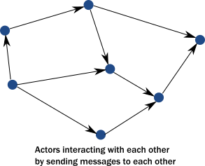

# 演员模型如何满足现代分布式系统的需求

As described in the previous topic, common programming practices do not properly address the needs of demanding modern systems. Thankfully, we don't need to scrap everything we know. Instead, the actor model addresses these shortcomings in a principled way, allowing systems to behave in a way that better matches our mental model. The actor model abstraction allows you to think about your code in terms of communication, not unlike the exchanges that occur between people in a large organization.

正如前一个主题所述，通用编程实践并不能正确解决要求苛刻的现代系统的需求。谢天谢地，我们不需要放弃我们所知道的一切。相反，演员模型以一种原则性的方式解决了这些缺点，使系统的行为方式能够更好地符合我们的心理模型。演员模型允许您从沟通的角度思考自己的代码，这与大型组织中的人员之间进行的交流相似。

Use of actors allows us to:

使用演员模型让我们能够：

 * Enforce encapsulation without resorting to locks.
 * 强制封装而不诉诸锁定。
 * Use the model of cooperative entities reacting to signals, changing state, and sending signals to each other to drive the whole application forward.
 * 使用协作实体对信号作出反应，状态改变，并相互发送信号来驱动整个应用程序。
 * Stop worrying about an executing mechanism which is a mismatch to our world view.
 * 不要担心与我们的世界观不匹配的执行机制。

### Usage of message passing avoids locking and blocking

### 消息传递的使用避免了锁定和阻塞

Instead of calling methods, actors send messages to each other. Sending a message does not transfer the thread of execution from the sender to the destination. An actor can send a message and continue without blocking.Therefore, it can accomplish more in the same amount of time.

演员不是调用方法，而是互相发送消息。发送消息不会将执行线程从发送方传输到目标放。Actor可以发送消息并继续做下面的事而不受阻塞。因此，它可以在相同的时间内完成更多的工作。

With objects, when a method returns, it releases control of its executing thread. In this respect, actors behave much like objects, they react to messages and return execution when they finish processing the current message.In this way, actors actually achieve the execution we imagined for objects:

当对象的一个方法返回时，它释放对其执行线程的控制。在这方面，Actor的行为与对象非常相似，他们对消息作出反应，并在处理完当前消息时返回执行。通过这种方式，Actor实际上实现了我们对对象行为的设想：

An important difference between passing messages and calling methods is that messages have no return value.By sending a message, an actor delegates work to another actor. As we saw in @ref:[The illusion of a call stack](actors-motivation.md#the-illusion-of-a-call-stack),if it expected a return value, the sending actor would either need to block or to execute the other actor's work on the same thread.Instead, the receiving actor delivers the results in a reply message.

传递消息和调用方法之间的一个重要区别是消息没有返回值。通过发送消息，Actor将工作委托给另一个Actor。正如我们在[调用堆栈的幻觉中](https://doc.akka.io/docs/akka/current/guide/actors-motivation.html#the-illusion-of-a-call-stack)所看到的，如果发送Actor期望返回结果，则要么发送Actor进入阻塞状态要么在同一线程上执行其他的Actor工作。其实，接收Actor以回复消息的方式返回结果。

The second key change we need in our model is to reinstate encapsulation. Actors react to messages just like objects "react" to methods invoked on them. The difference is that instead of multiple threads "protruding" into our actor and wreaking havoc to internal state and invariants, actors execute independently from the senders of a message, and they react to incoming messages sequentially, one at a time. While each actor processes messages sent to it sequentially,different actors work concurrently with each other so that an actor system can process as many messages simultaneously as the hardware will support.

我们需要的第二个关键变化是恢复封装。Actor对消息作出反应，就像一个对象响应方法调用那样。不同之处在于，不是多个线程“突出”进入我们的演员，并且对内部状态和不变量造成严重破坏，Actor的执行独立于消息的发送者，并且他们逐个地顺序地对输入消息作出反应。当每个Actor按顺序处理发送给它的消息时，不同的Actor会相互并行工作，这样一个Actor系统就可以以硬件条件为基础，同时处理尽可能多的消息。

Since there is always at most one message being processed per actor,the invariants of an actor can be kept without synchronization. This happens automatically without using locks:

由于每个角色总是最多处理一个消息，所以角色的不变量可以保持不同步。这自然而然不用使用锁：

In summary, this is what happens when an actor receives a message:

总之，当一个Actor接收到消息时，发生了如下的东西：

  1. The actor adds the message to the end of a queue.
  2. Actor把消息添加到队列尾部。
  3. If the actor was not scheduled for execution, it is marked as ready to execute.
  4. 如果这个Actor没有被计划为执行，那么它被标记为准备执行。
  5. A (hidden) scheduler entity takes the actor and starts executing it.
  6. 一个(隐藏)的调度实体获取这个Actor，并且开始执行这个Actor。
  7. Actor picks the message from the front of the queue.
  8. Actor获取队列头部的消息。
  9. Actor modifies internal state, sends messages to other actors.
  10. Actor改变内部状态，向其他Actor发送消息。
  11. The actor is unscheduled.
  12. Actor进入未调度状态。

To accomplish this behavior, actors have:

要完成这样的行为，Actor需要：

 * A mailbox (the queue where messages end up).
 * 信箱(消息结束的队列)
 * A behavior (the state of the actor, internal variables etc.).
 * 行为(Actor的状态，内部变量等)
 * Messages (pieces of data representing a signal, similar to method calls and their parameters).
 * 消息(表示信号的数据片断，很像方法调用和它的参数)
 * An execution environment (the machinery that takes actors that have messages to react to and invokes
   their message handling code).
 * 执行环境(一套获取Actor响应并调用他们信息处理编码的机制)
 * An address (more on this later).
 * 地址(详见后续)

Messages go into actor mailboxes. The behavior of the actor describes how the actor responds to
messages (like sending more messages and/or changing state). An execution environment orchestrates a pool of threads to drive all these actions completely transparently.

消息进到Actor信箱中，Actor的行为描述了Actor如何响应消息(比如说发送更多的消息或者改变状态)。执行环境编排一组线程以完全透明的方式驱动完成所有这些操作。

This is a very simple model and it solves the issues enumerated previously:

这是一个非常简单的模型，他解决了之前列举的那些问题：

 * Encapsulation is preserved by decoupling execution from signaling (method calls transfer execution,
   message passing does not).
 * 通过将执行与信令解耦（方法调用传输执行，消息传递不执行）来保留封装。
 * There is no need for locks. Modifying the internal state of an actor is only possible via messages, which are processed one at a time eliminating races when trying to keep invariants.
 * 不需要锁。 只能通过消息来修改Actor内部状态，消息被逐个处理，消除了对资源维持的竞争。
 * There are no locks used anywhere, and senders are not blocked. Millions of actors can be efficiently scheduled on a dozen of threads reaching the full potential of modern CPUs. Task delegation is the natural mode of operation for actors.
 * 再也用不到锁，发送者也不会被阻塞。 数十线程可以有效地安排数百万Actor，充分发挥现代CPU的潜力。 委托任务是Actor天生的操作模式。
 * State of actors is local and not shared, changes and data is propagated via messages, which maps to how modern memory hierarchy actually works.    In many cases, this means transferring over only the cache lines that contain the data in the message while keeping local state and data cached at the original core. The same model maps exactly to remote communication where the state is kept in the RAM of machines and changes/data is propagated over the network as packets.
 * Actor的状态是本地而非共享的，变化和数据通过消息传播，这与现代存储器层次结构实际工作的方式相一致。 在许多情况下，这意味着只传输包含消息中数据的缓存行，同时将本地状态和数据缓存在原始内核中。 通过远程通信映射同样的模型，其中状态保存在机器的RAM中，而更改/数据则作为数据包通过网络传播。

### Actors handle error situations gracefully

Since we no longer have a shared call stack between actors that send messages to each other, we need to handle error situations differently. There are two kinds of errors we need to consider:

既然我们不在Actor之间分享调用堆栈而是传递消息，那么我们就需要以不同的方式处理错误状态。这里有两类错误需要考虑：

 * The first case is when the delegated task on the target actor failed due to an error in the task (typically some validation issue, like a non-existent user ID). In this case, the service encapsulated by the target actor is intact, it is only the task that itself is erroneous.The service actor should reply to the sender with a message, presenting the error case. There is nothing special here, errors are part of the domain and hence become ordinary messages.
 * 第一种情况是由于任务中的错误（通常是某些验证问题，如不存在的用户ID）导致目标Actor上的委派任务失败。 在这种情况下，目标Actor封装的服务是完好的，只是任务本身是错误的。服务Actor应该用消息回复发件人，提出错误情况。 这里没有什么特别的地方，错误是域的一部分，因此用普通的消息表示。
 * The second case is when a service itself encounters an internal fault. Akka enforces that all actors are organized into a tree-like hierarchy, i.e. an actor that creates another actor becomes the parent of that new actor. This is very similar how operating systems organize processes into a tree. Just like with processes, when an actor fails,its parent actor is notified and it can react to the failure. Also, if the parent actor is stopped,all of its children are recursively stopped, too. This service is called supervision and it is central to Akka.
 * 第二种情况是服务本身遇到内部故障。 Akka强制将所有Actor组织为树状分层结构，即创建另一个Actor的Actor成为该新Actor的父节点。 这与操作系统如何将进程组织到树中非常相似。 就像流程一样，当一个Actor失败时，其父节点会得到通知，并且可以对失败做出反应。 另外，如果父节点停止，则其所有子项也都会递归停止。 这项服务被称为监督，它是Akka的核心。

A supervisor (parent) can decide to restart its child actors on certain types of failures or stop them completely on others. Children never go silently dead (with the notable exception of entering an infinite loop) instead they are either failing and their parent can react to the fault, or they are stopped (in which case interested parties are automatically notified). There is always a responsible entity for managing an actor: its parent. Restarts are not visible from the outside: collaborating actors can keep continuing sending messages while the target actor restarts.

监督者（父节点）可以决定在某些类型的故障时重新启动子Actor，或者完全停止它。 子Actor永远不会不声不响的死去（有一个明显的例外是进入一个无限循环），他们要么失败了那么其父节点可以对错误作出反应，或者他们停止（在这种情况下，相关的节点会自动得到通知）。 总有一个负责管理Actor的实体：它的父节点。 从外部是看不到重新启动的：当目标Actor重新启动时，与之协作的Actor可以继续发送消息。

Now, let's take a short tour of the functionality Akka provides.

现在，我们来简单介绍一下Akka提供的功能。