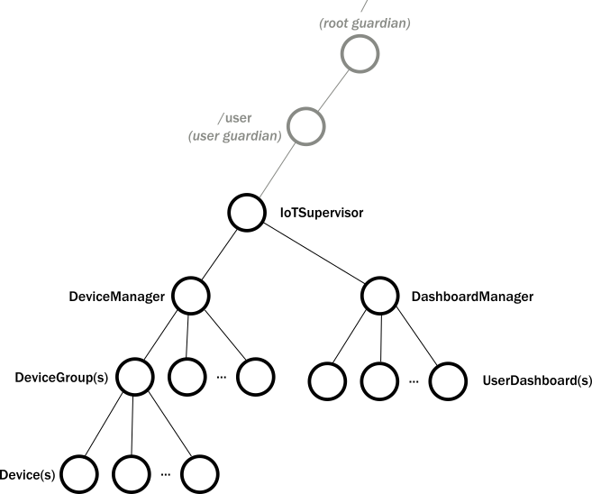

# 第2部分：创建第一个Actor

With an understanding of actor hierarchy and behavior, the remaining question is how to map the top-level components of our IoT system to actors. It might be tempting to make the actors that represent devices and dashboards at the top level. Instead, we recommend creating an explicit component that represents the whole application. In other words, we will have a single top-level actor in our IoT system. The components that create and manage devices and dashboards will be children of this actor. This allows us to refactor the example use case architecture diagram into a tree of actors:

在了解了Actor层级结构和行为后，剩下的问题就是如何将我们物联网系统的顶级组件映射到Actor。将代表设备和仪表板的Actor置于顶层可能是诱人的。但我们建议显示的创建一个能代表整个应用程序的组件。也就是说，我们将在我们的物联网系统中创建一个顶级Actor。创建和管理设备和仪表板的组件将是该Actor的子节点。这使我们可以将示例架构图重构为Actor树：

We can define the first actor, the IotSupervisor, with a few simple lines of code. To start your tutorial application:

我们可以用几行简单的代码定义第一个Actor IotSupervisor，来开始您的教程应用：

1. Create a new `IotSupervisor` source file in the `com.lightbend.akka.sample` package.
1. 在`com.lightbend.akka.sample`包中创建一个新的`IotSupervisor`文件。
1. Paste the following code into the new file to define the IotSupervisor.
1. 将以下代码粘贴到新文件中来定义IotSupervisor。

Scala
:   @@snip [IotSupervisor.scala]($code$/scala/tutorial_2/IotSupervisor.scala) { #iot-supervisor }

Java
:   @@snip [IotSupervisor.java]($code$/java/jdocs/tutorial_2/IotSupervisor.java) { #iot-supervisor }

The code is similar to the actor examples we used in the previous experiments, but notice:

该代码与我们在之前的实验中使用的Actor示例类似，但请注意：

* Instead of `println()` we use @scala[the `ActorLogging` helper trait] @java[`akka.event.Logging`], which directly invokes Akka's built in logging facility.
* 相比`println()`，我们使用的`ActorLogging`特质 ，它将直接调用Akka内置的日志记录工具。
* We use the recommended pattern for creating actors by defining a `props()` @scala[method in the [companion object](http://docs.scala-lang.org/tutorials/tour/singleton-objects.html#companions) of] @java[static method on] the actor.
* 我们推荐使用props()—[伴侣对象](http://docs.scala-lang.org/tutorials/tour/singleton-objects.html#companions)中定义的方法来创建Actor。(这段翻译的……还是看英文吧)

To provide the `main` entry point that creates the actor system, add the following code to the new @scala[`IotApp` object] @java[`IotMain` class].

创建Actor系统的`main`入口点，请将以下代码添加到新`IotApp`对象中 。

Scala
:   @@snip [IotApp.scala]($code$/scala/tutorial_2/IotApp.scala) { #iot-app }

Java
:   @@snip [IotMain.java]($code$/java/jdocs/tutorial_2/IotMain.java) { #iot-app }

The application does little, other than print out that it is started. But, we have the first actor in place and we are ready to add other actors.

该应用程序几乎没有打印出它启动的情况。但是我们有了第一个Actor，我们准备添加其他Actor。

## 接下来?

In the following chapters we will grow the application gradually, by:

在接下来的章节中，我们将逐步扩展应用程序，方法是：

  1. Creating the representation for a device.
  2. 为设备创建表示形式。
  3. Creating the device management component.
  4. 创建设备管理组件。
  5. Adding query capabilities to device groups.
  6. 为设备组添加查询功能。

